# UML — The Last Re:wind

> `Assets/01.Scripts` 전체(180개 스크립트 - 대부분 `Minsung.*` 네임스페이스, `03.Boss/Boss2/`는 팀 컨벤션상 무네임스페이스. 샘플 코드였던 `Ex/`는 2026-07-18 완전 제거됨)를 기준으로 생성. Mermaid `classDiagram` 문법 사용 (GitHub/대부분의 Markdown 뷰어에서 렌더링됨).
> 클래스당 전체 멤버가 아니라 역할을 보여주는 핵심 멤버만 표기. 코드가 실제 소스이며, 이 문서는 구조 파악용 스냅샷이다.

## 목차

1. [시스템 개요](#1-시스템-개요)
2. [TimeSystem 코어](#2-timesystem-코어-riewind-인프라)
3. [Player (컴포넌트 코디네이터)](#3-player-컴포넌트-코디네이터)
4. [Monster](#4-monster)
5. [Boss](#5-boss)
6. [Interactive](#6-interactive)
7. [Common / Utility (싱글톤 · 공통 인터페이스)](#7-common--utility)
8. [Achievement / Backend / Visual](#8-achievement--backend--visual)
9. [Sound / Camera / UI](#9-sound--camera--ui)

---

## 1. 시스템 개요

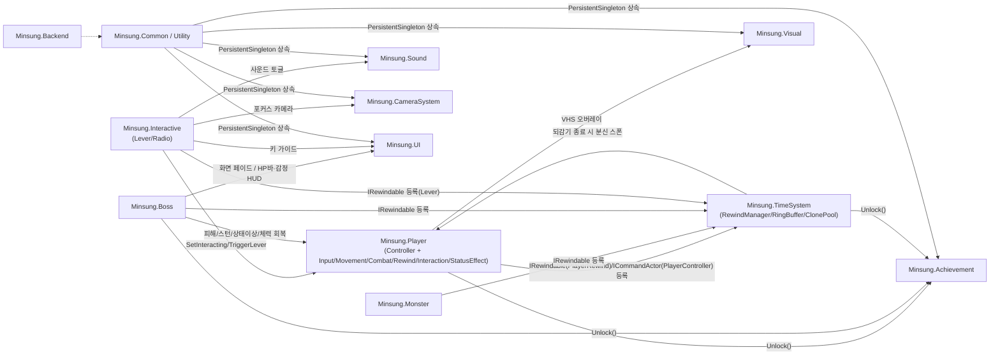

---

## 2. TimeSystem 코어 (리와인드 인프라)

되감기에 참여하는 모든 클래스(Player/Monster/Boss/Clone/Interactive)가 공유하는 기반.

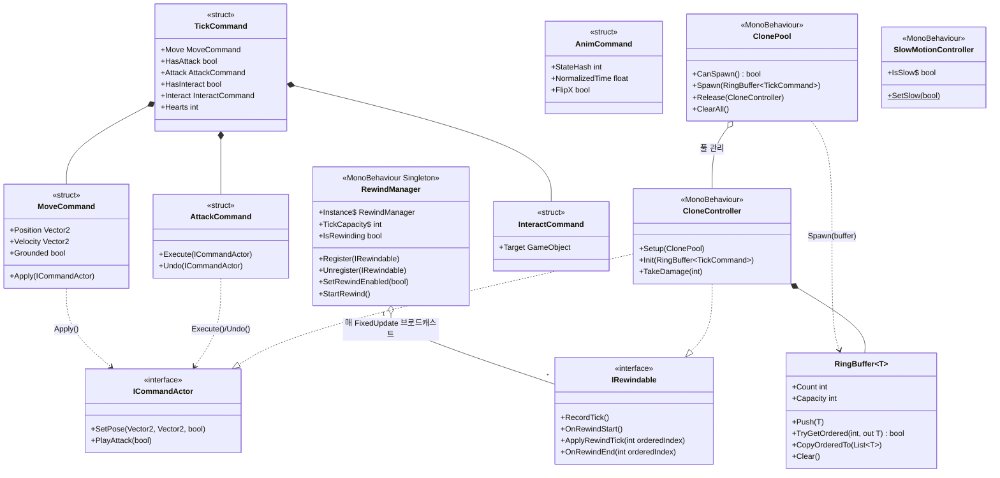

> `RingBuffer<T>`는 이 외에도 `MonsterTick`, `CloneTick`, `BossFrame`, `Phase2Frame`, `Phase3Frame`, `Vector2`, `bool` 등 참여자별로 다른 타입 인자를 갖는다 (제네릭 재사용).

---

## 3. Player (컴포넌트 코디네이터)

2026-07 리팩토링으로 단일 `PlayerController`가 **코디네이터 + 기능 컴포넌트**로 분리됐다. `PlayerController`는 컴포넌트를 연결/조율하고 외부가 참조하는 상태를 파사드로 대표하며, `IRewindable`은 `PlayerRewind`가 구현한다.

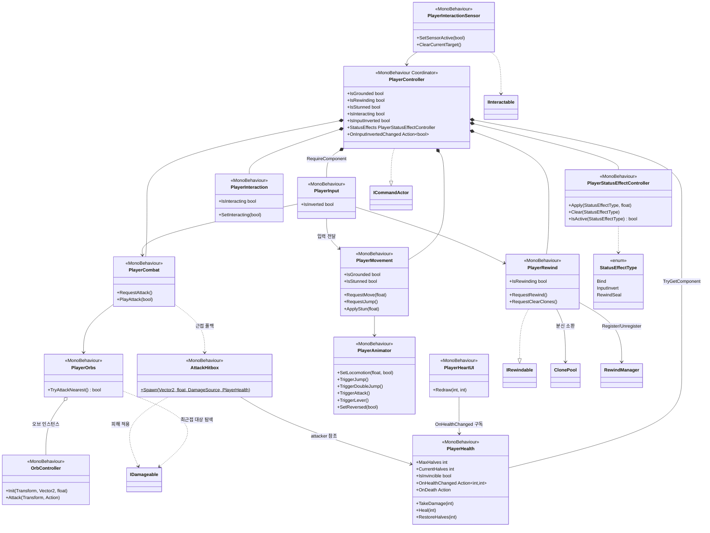

> 입력은 `PlayerInput`이 읽어 각 컴포넌트로 전달한다(Player BT 제거, 2026-07-06). 상호작용 E키만 `PlayerInteractionSensor` 담당. 트리거 판정(HeartPickup/DamageHazard)이 "본체"를 루트 `PlayerController`로 식별하므로 `ICommandActor`는 코디네이터에 남긴다.

---

## 4. Monster

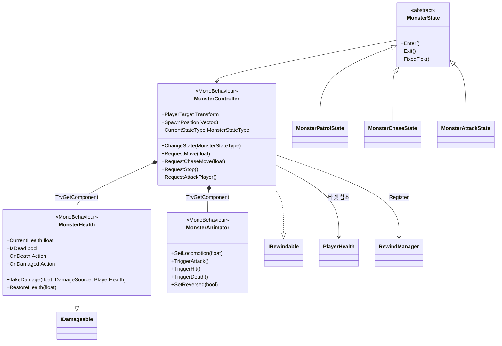

---

## 5. Boss

가장 복잡한 서브시스템 — 4페이즈 상태 패턴 + 근접 유닛(본체/분신) 계층.

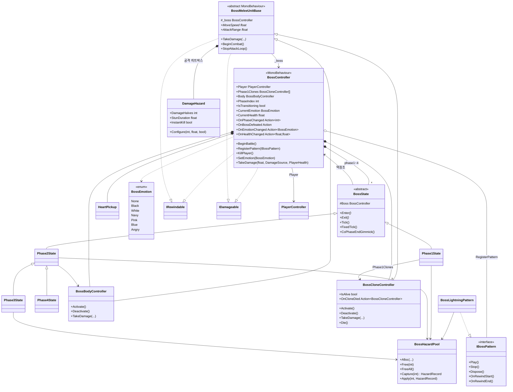

---

## 5.5 Boss2 (Map3, 진욱 - 3~4페이즈 별도 시스템)

`Minsung.Boss`를 수정하지 않는 독립 시스템. 팀 컨벤션상 **네임스페이스 없음**(무네임스페이스). 재사용 가능한 공용 인프라(`BossHazardPool`/`DamageHazard`/`HeartPickup`/`RewindManager`/`IDamageable`/`IRewindable`)만 소비한다. 씬 배선·코드 흐름·좌표 변수 정리는 `claude/boss.md` 5장 참고.

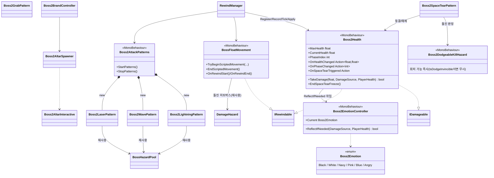

- `Boss2DataSO`(`00.Common/Data/`)는 Boss2 전용 밸런싱 DB로 **GameDatabaseSO 트리에 연결하지 않고** 컴포넌트에 직접 드래그한다(GameDB 정적 접근자 대상 아님).
- 감정 클래스는 `Minsung.Boss` 동명 타입과의 컴파일 충돌 회피를 위해 `Boss2` 접두사를 쓴다(`claude/boss.md` 5-1절).
- 공간찢기(민성 구현)는 절대 즉사 `DamageHazard`/`PlayerHealth.Kill()`을 건드리지 않고 전용 `Boss2DodgeableKillHazard`로만 처리한다.

---

## 6. Interactive

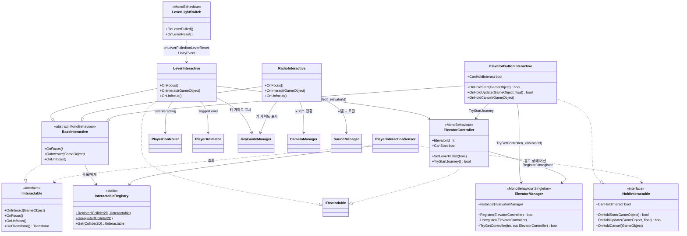

> `LeverInteractive`/`ElevatorController`는 `IRewindable`이라 분신이 `InteractCommand`로 재연한다(엘리베이터는 완료된 홀드만 기록). `RadioInteractive`는 사운드/카메라 포커스만 토글해 되감기 기록 대상이 아니다. `IHoldInteractable`은 상호작용 키를 일정 시간 눌러 유지해야 완료되는 오브젝트 계약(`PlayerInteractionSensor`가 상태 머신으로 처리) - 엘리베이터 버튼이 현재 유일한 구현체.

---

## 7. Common / Utility

싱글톤 보일러플레이트, 시스템 전역 공통 인터페이스, 그리고 밸런싱 데이터 DB(GameDB).

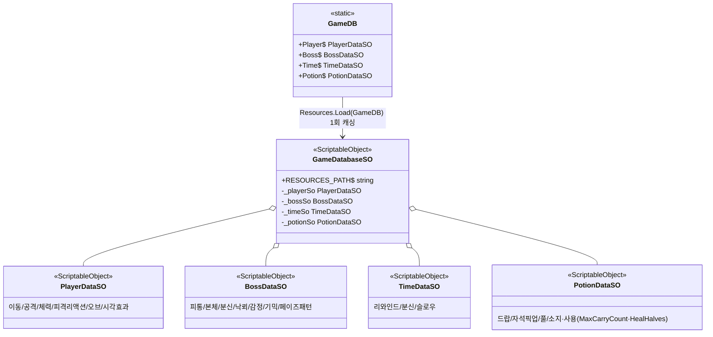

- 에셋: `08.Data/Resources/GameDB.asset`(루트) / `08.Data/Player|Boss|Time|Potion/*DB.asset`
- 코드 계약값(입력 키, epsilon, 구조 상수)은 `Constants`(partial) 유지

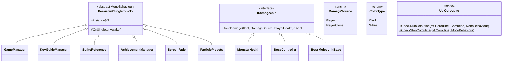

---

## 8. Achievement / Backend / Visual

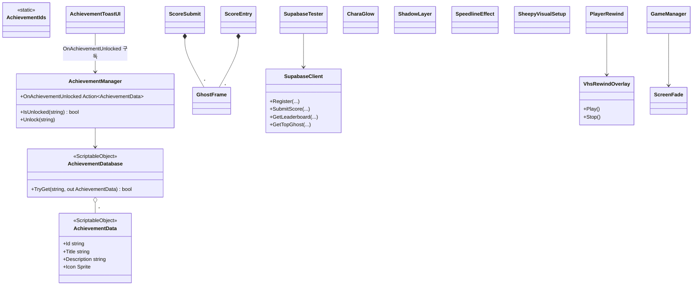

---

## 9. Sound / Camera / UI

되감기와 무관한 연출/피드백 계층. 대부분 `PersistentSingleton<T>`로 씬 전역 접근한다.

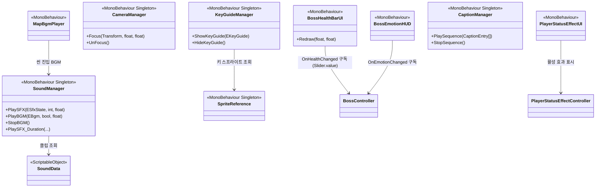

> 과거 `Ex/`(BossManager/BossUIManager/BossConditionSlotUI/BossDataSO) 샘플 코드는 진행바의 `Slider` 참고 구현을 정식 `BossHealthBarUI`(Minsung.UI)로 승격한 뒤 2026-07-18 완전 삭제됐다.

---

## 참고

- 클래스/인터페이스 수: 총 180개 스크립트 (enum/struct/static 유틸 포함 - 대부분 `Minsung.*`, `03.Boss/Boss2/`는 무네임스페이스).
- `IRewindable` 구현체: `PlayerRewind`, `MonsterController`, `BossController`, `BossMeleeUnitBase`(->`BossBodyController`, `BossCloneController`), `CloneController`, `LeverInteractive`, `ElevatorController`, `PotionManager`, `Boss2Health`, `BossFloatMovement`(Boss2).
- `ICommandActor` 구현체: `PlayerController`(코디네이터), `CloneController`.
- `IDamageable` 구현체: `MonsterHealth`, `BossController`, `BossMeleeUnitBase`(->`BossBodyController`, `BossCloneController`), `Boss2Health`(Boss2).
- `IHoldInteractable` 구현체: `ElevatorButtonInteractive`.
- `PersistentSingleton<T>` 상속: `GameManager`, `KeyGuideManager`, `SpriteReference`, `AchievementManager`, `ScreenFade`, `ParticlePresets`, `CameraManager`, `SoundManager`, `CaptionManager`, `ElevatorManager`.
- 다이어그램은 스냅샷이므로, 클래스 추가/삭제나 인터페이스 변경 시 수동으로 갱신해야 한다.
