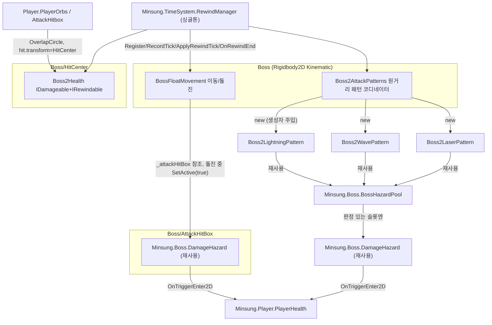

# 보스 (Azathoth) — 통합 기획 및 구현 문서

> 기존 `boss-design.md` / `boss2-handover.md` / `boss2-handover-prompt-next.md` / `boss2-code-guide.md` 4개 문서를 이 문서 하나로 통합했다(2026-07-20). 위 4개 파일은 제거됨 — 보스 관련 기획/구현/디버깅 정보는 전부 이 문서를 참고한다.

> **검토 범위**: 2026-07-20 기준 전달 폴더에는 이 문서만 있고 실제 Boss2 소스·씬·프리팹은 포함되어 있지 않았다. 따라서 아래의 기존 "구현 완료/검증 완료" 표시는 인수인계 기록으로만 취급하며, 저장소의 실제 코드와 Unity Play Mode에서 다시 확인하기 전에는 현재 상태를 보증하지 않는다. 11~14장은 이 제약을 반영해 추가한 구현·검토 지침이다.

## 0. 개요 / 팀 분담

보스는 총 4페이즈, 두 사람이 절반씩 나눠 담당하고 씬도 분리되어 있다.

| 담당 | 시스템 | 페이즈 | 씬 | 네임스페이스 |
|---|---|---|---|---|
| 민성 | Boss1 (`BossController` 계열) | 1페이즈, 2페이즈 | `Map2` | `Minsung.Boss` |
| 진욱 | Boss2 (신규 별도 시스템) | 3페이즈, 4페이즈 | `Jinwook/Map3` | 없음 (팀 컨벤션상 진욱 코드는 네임스페이스 미사용) |

> **예외**: 4페이즈의 "공간찢기" 패턴은 Boss2(Map3) 소속이지만 **민성이 직접 구현**한다(전용 무적키 신설 등 코어 시스템 영역과 맞닿아 있어서). 4-4절 참고.

- 전투는 1페이즈부터 시작해 2→3→4페이즈까지 **하나의 흐름**으로 이어진다. **전투 타이머도 1페이즈 시작부터 4페이즈까지 끊기지 않고 연속으로 기록되어야 한다.**
- Boss2는 원칙적으로 `Minsung.Boss.*`를 수정하지 않는 별도 시스템이다. 재사용 가능한 범용 인프라(`BossHazardPool`, `DamageHazard`, `IDamageable`, `IRewindable`, `RewindManager`, `HeartPickup`)는 그대로 참조한다. 기존 공용 타입의 의미를 바꿔야 하는 요구가 생기면 먼저 Boss2 전용 어댑터/컴포넌트로 해결하고, 정말 공용 계약 변경이 필요한 경우에만 양 담당자 합의 후 별도 작업으로 진행한다. 공간찢기의 회피 가능한 즉사는 `DamageHazard` 전체를 수정하지 않고 Boss2 전용 판정으로 구현한다(11-2절).

## 1. 공통 규칙 (전 페이즈)

- **보스 총 체력**: 64,000 (Boss1 쪽 수치 — 페이즈당 16,000 소모, 페이즈 하한 도달 시 피통 동결 후 종료 기믹). Boss2는 별도 독립 피통(`Boss2Health.MaxHealth`, 현재 임시값 — 4장 참고)
- **피격 데미지**: 보스 본체 공격 = 하트 1칸, 보스 분신 공격 = 하트 반칸
- **전투 타이머**: 되감기와 무관하게 계속 흐르는 실시간 타이머. 10분(600초) 초과 시 플레이어 즉사. **1페이즈부터 4페이즈까지 연속 기록되어야 함** (현재 구현은 이 요구사항과 어긋남 — 8장 "알려진 기술 이슈" 참고)
- **타임 리와인드**: 되감기 시 보스 체력도 함께 되돌아간다. **4페이즈에서도 리와인드를 정상 사용할 수 있다** — 과거 "4페이즈 진입 시 리와인드 시스템 삭제" 규정은 폐기됨(2026-07-20 변경, 3장 참고)
- 랜덤 패턴은 결정 로그로 재현하는 것이 원칙이나, 이 구현 수준은 Boss1(1~3페이즈)만 해당된다. Boss2(3~4페이즈)는 아직 결정 로그가 없어 되감기 후 패턴 타이밍이 새로 랜덤 결정된다(8장 참고).

## 2. 감정 상태 (`BossEmotion` / `Boss2Emotion`, 페이즈와 별개로 공통 패턴 변조)

| 감정 | 효과 |
|---|---|
| 검정(Black) | 모든 공격(본체+분신) 반사 |
| 하양(White) | 플레이어 **본체** 공격만 반사 |
| 남색(Navy) | 플레이어 **분신** 공격만 반사 |
| 핑크(Pink) | 낙뢰 낙하 비율 x2(더 자주) |
| 파랑(Blue) | 낙뢰 낙하 비율 x1/2(덜 자주) + 맵에 하트 1칸 회복 픽업 제공 |
| 화남(Angry) | 3페이즈 고정 패턴(Boss1) — 10초마다 1초간 플레이어 키반전(혼란), 상태 아이콘 표시. **4페이즈도 화남 고정 유지**(신규 확정) |

반사 판정은 `DamageSource`(Player/PlayerClone)로 구분. Boss2 쪽은 `Boss2Health.TakeDamage`가 부모의 `Boss2EmotionController.ReflectIfNeeded(source, attacker)`를 호출해 처리(원본 `Minsung.Boss.BossEmotionController`를 동일 로직으로 이식, 명명 규칙은 6장 참고).

## 3. 낙뢰 (공통 패턴, 페이즈 무관)

- 4초에 한 번씩 맵 랜덤 위치에 위에서 아래로 낙하
- 피격 시 하트 1칸 차감 + 0.5초 이동 불가(스턴)
- Boss1: `BossLightningPattern` / Boss2: `Boss2LightningPattern`(감정 Pink/Blue 배율 반영, 흰색 틴트 필수 — 8장 함정 참고)

## 4. 페이즈별 상세

### 4-1. 1페이즈 (64,000 ~ 48,000, Map2, 민성) — ✅ 구현 완료

- 보스 분신 2체 등장, **각 분신은 독립 피통**(본체 총 피통과 분리, 감정 반사 규칙만 공유)
- 분신 2체 개별 체력바 표시(보스 총 체력바 대신, 25% 구분선 없음)
- 분신은 근접 공격, 애니메이터 모션
- **종료 기믹(즉사 레이저)**: 분신 2체를 모두 잡으면 발동
  1. 맵 전체 레이저를 빨강/파랑/초록 랜덤 순서로 3회 예고 발사 — 안전구역은 **슬로우모션 중에만** 표시되며 발사 시점까지만 표시
  2. 예고 종료 5초 후 같은 순서로 실전 발사 — 해당 색 안전구역 밖에 있으면 즉사
  3. 파훼 성공 시 보스 본체 등장(2페이즈 시작), 본체 체력바는 **75%부터** 표시(1페이즈 몫 25%를 분신이 대신 소화)
- 즉사 판정은 x축 기둥 기준(세로 전체), 레이저 색 시퀀스는 중복 허용(연속 같은 색 가능)

### 4-2. 2페이즈 (48,000 ~ 32,000, Map2, 민성) — ✅ 구현 완료

- 본체(`BossBodyController`) 등장, 1페이즈 분신 근접 패턴 + 장풍(맵 아래→위 상승 해저드, 애니메이션 포함) 추가
- **미해결 스펙 해석 이슈**: 기획 문구는 "1페이즈 분신 근접 패턴 유지"인데, 현재 구현은 `Phase1State.Exit`가 분신을 전부 비활성화하고 본체만 활성화한다. 분신을 실제로 유지할지, "본체가 같은 근접 패턴을 수행"으로 충족되는지 기획 해석 확인 필요(과거부터 미해결로 남아있던 항목)
- **종료**: 아웃트로 영상 재생 → `GameManager.LoadSceneFadeInOnly`로 `Map3`(진욱 구역) 진입. `Map2`는 1~2페이즈만 담당하고 3~4페이즈는 `Map3`에서 별도 보스 오브젝트/DB로 진행

### 4-3. 3페이즈 (Map3, 진욱) — ✅ 구현 완료 (낙인/제단 3P 이동은 🔧 코드 반영, Play 재검증 대기)

- 화남(Angry) 감정 고정 + 2페이즈 패턴(근접+장풍류) 유지 + 맵을 가로지르는 레이저 추가
- 레이저: 발사 전 1.5초 빨간 점멸 경고 → 1초 발사. 시작 방향/도착 지점 랜덤(현재 좌→우 고정, 높이만 랜덤 — 정지 빔이라 게임플레이 차이는 없음)
- Boss2 본체는 **부유체**(중력 없음, Kinematic Rigidbody2D + 코드로 위치 직접 제어) — 이동 로직은 5장 참고
- **낙인 / 정화 제단 (2026-07-20, 4페이즈에서 이동)**: 3페이즈 시작(보스 스폰) 시점부터 10초마다 낙인 스택 +1. **7스택 도달 시 즉사("낙인사") + 3페이즈 재시작**(체력/위치 리셋). 제단(`Altar`)이 30초마다 맵 바닥 랜덤 위치에 출현, E키 3초 홀드로 스택 0 초기화. 보스가 제단에 닿으면 제단 소멸(스포너가 재소환). **4페이즈 진입 시 이 시스템은 완전히 정지**한다(스택 증가도, 제단 소환도 멈춤 — 4페이즈에는 낙인 기믹이 없음)
- **낙인 폭발 (낙인 스택 연동 광역판정)**: 스택 3 / 5 / 7 도달 시 각 1회, 보스 자신의 위치를 중심으로 광역 판정 발동. 구현은 `Boss2WavePattern`의 폭발 에셋(`boss2_fx_explosion-sheet0.png`) 재사용, 랜덤 위치 대신 보스 자기 위치 중심 + 넓은 반경. 스택 7 임계치는 낙인사와 동시 발동(판정 겹쳐도 무해)

### 4-4. 4페이즈 (Map3, 진욱) — 🔧 구현 진행 중, 기획 확정(2026-07-20)

**정책**

- 화남(Angry) 감정 고정 유지(10초마다 1초 키반전)
- **타임리와인드 잠금 없음** — 4페이즈에서도 리와인드 정상 사용 가능(과거 규정 폐기). `Boss2Health.AdvancePhase()`의 `RewindManager.AcquireRewindLock()` 잠금 로직 제거 완료(2026-07-20)
- **사망/리스폰**: 최종 목표는 4페이즈 사망 시 Map2의 리스폰 지점에서 재시작. **개발 완료 전까지는 임시로 현재처럼 맵 안에서 즉시 부활 유지.** 체력(피통) 수치는 테스트하며 확정
- **보스 사망(처치) 연출**: 미확정, 별도 논의 예정

**신규 패턴 3종** (기존 3종 낙뢰/강타/레이저에 전부 추가, 대체 아님. 낙인/제단은 3페이즈로 이동했으므로 4페이즈엔 없음 — 4-3절 참고)

| 패턴 | 쿨타임 | 담당 | 내용 |
|---|---|---|---|
| 손아귀 | 20초, 50% 확률로 시전 | 진욱 | 하트 1.5칸 피해. 보스 팔에 붙잡히는 모션 → 2초간 포박 → 공중으로 투척 |
| 공간찢기 (즉사기) | **체력 10% 도달 시 1회만** (2026-07-20 확정 - 기존 "쿨타임 1분 20초" 주기 패턴안은 폐기) | **민성** | **패턴배너로 사전 예고**("보스보다 시간을 느리게 하여 보스의 패턴을 막아보세요!") → 맵 흑백 전환 + 슬로우 → 5방향 돌진 경로(선)를 미리 보여줌 → 실제 5회 연속 돌진. **파훼: 신설 전용 무적키**로 충돌 순간 회피(로스트아크 카멘 4관문 '영전' 패턴 참고, Shift 슬로우모션과는 별개의 새 키) |
| 원혼방출 | 1분 | 진욱 | **패턴배너로 사전 예고**("혼돈의 구역에서 보스의 악기가 곧 흘러넘쳐 방출될 것 같다.") → 맵 3곳 중 1곳에 즉사 구역 설치. 해당 구역에 있으면 모든 방어/무적 무시하고 즉사(메이플스토리 카링 Spirit Overflow 패턴 참고) |

공간찢기는 4페이즈(Map3, Boss2) 소속 패턴이지만 **민성이 구현**한다(0장 예외 참고) — Boss2 쪽(`Boss2AttackPatterns`, 4페이즈 진입 트리거, 패턴배너 예고 타이밍)과의 연동 지점은 협의 필요.

**공간찢기 상세 설계 (2026-07-20 확정)**

- **트리거**: 4페이즈 진입 후 `Boss2Health.CurrentHealth`가 `MaxHealth`의 10%에 처음 도달하는 순간 딱 1회만 발동한다. 발동 즉시 체력을 10% 지점에서 **동결**(더 이상 데미지가 안 먹힘) - 5회 돌진 시퀀스가 끝날 때까지 유지
- **처치 조건**: 동결은 영구가 아니다. 시퀀스가 끝나면(생존 성공/실패 무관) 동결이 풀리고, 그 뒤로 다시 정상적으로 데미지가 들어가야 남은 체력을 마저 깎아 처치할 수 있다 - "생존 = 즉시 승리"가 아니라 "생존해야 마무리 타격을 넣을 기회가 생기는" 구조
- **5회 돌진 구성 (2026-07-21 화면 연출 재설계 - 아래 내용이 최신)**: 4개 고정 라인(**시작점/종료점을 민성이 직접 지정**, 아레나를 가로지르는 고정 선) + 1개 플레이어 조준 라인 총 5회
  - 고정 4개의 **실행 순서는 매번 랜덤**(발동마다 셔플) - 어느 라인이 몇 번째로 나갈지 고정되어 있지 않다
  - 예고(텔레그래프)는 고정 4개만 동시에 점멸 표시. 플레이어 조준 라인은 사전 예고하지 않는다(아래 화면 연출 자체가 예고 역할)
  - 플레이어 조준 라인은 **항상 마지막(5번째)** - 시작점은 전용 앵커(`_playerLineStart`, 없으면 보스 현재 위치로 대체), 종료점은 **그 라인이 실행되는 순간의 플레이어 위치**(시퀀스 시작 시점이 아니라 4개 고정 라인이 전부 끝난 뒤 재조준)
- **화면 연출(로스트아크 영전 순차 파훼)**: 화면 균열 연출(`ScreenTearOverlay`)은 5조각으로 미리 갈라지는 게 아니라, 처음엔 전 조각이 원본과 이음매 없이 동일하게 보인다. 고정 라인이 실행되는 동안 그 순번에 해당하는 조각의 카메라만 보스를 실시간으로 추적하다가(`BeginTrackBoss`), 돌진이 끝나면 그 자리(End)에 고정된다(`FreezeShard`) - 한 번에 한 조각씩, 시간차로 갈라져 보인다. 마지막 라인이 시작되는 순간 그 조각만 흑백에서 컬러로 복귀(`SetShardColor`)해 "이게 진짜다"를 예고하고, 그 직후 보스가 실제로 플레이어를 향해 돌진한다 - 이 컬러 복귀 타이밍이 사실상 5번째 라인의 예고를 대신한다
- **파훼**: 각 돌진의 충돌 판정은 회피 가능 즉사(`Boss2DodgeableKillHazard`)다. 이 판정에 맞기 직전 전용 무적키(위 항목)로 회피해야 한다 - 특히 컬러 복귀 직후(마지막 돌진 직전)가 핵심 반응 타이밍이다. 기존 `DamageHazard._instantKill`은 절대 즉사 계약이므로 사용하지 않는다.
- **카메라 줌**: 공간찢기와 별개로, Boss2(Map3) 진입 시 플레이어 카메라 줌이 Boss1(Map2)과 다른 문제가 있었다 - `CameraManager`는 `PersistentSingleton`이라 Awake에서 항상 `Constants.Camera.PLAYER_ORTHOGRAPHIC_SIZE`(1.3)로 리셋되고, Boss1은 `BossController.BeginBattle()`에서 `SetPlayerZoom(Constants.Camera.BOSS_ORTHOGRAPHIC_SIZE)`(3.2, "아레나가 한 화면에 들어오는 값")를 호출해 덮어쓰지만 Boss2엔 이 호출이 없었다. `Boss2AttackPatterns.Start()`(보스 스폰 시점)에 동일 호출을 추가하고, `Boss2Health` 처치 시 `ResetPlayerZoom()`을 추가해 Boss1과 대칭을 맞췄다(2026-07-21).

**전용 무적키 (설계 수정 필요, `Minsung.Player`)** — 공간찢기 파훼용 키는 Shift 슬로우모션 및 E 상호작용과 반드시 분리한다. 현재 문서의 E키 재사용안은 제단 홀드와 회피가 동시에 발동하므로 폐기한다. 임시 기본값은 `LeftControl`로 두되 실제 Input 설정과 충돌 검사를 거쳐 확정한다. 무적 지속 1초(`PlayerDataSO.DodgeInvincibleDuration`) + 쿨타임 30초(`PlayerDataSO.DodgeInvincibleCooldown`, 발동 즉시부터 카운트)이며, 슬로우모션 중에도 실제 체감 시간이 변하지 않도록 `Time.unscaledTime` 또는 `WaitForSecondsRealtime` 기준으로 계산한다. `PlayerHealth.RequestDodgeInvincible()`은 `_isDodgeInvincible`을 켜 일반 피해와 **회피 가능 즉사**만 막고, 절대 즉사는 막지 않는다.

**중요 - 즉사 종류를 분리해야 함**: `DamageHazard._instantKill`은 `PlayerHealth.Kill()`을 직접 호출하고, `Kill()`은 보스전 타이머 초과나 원혼방출처럼 모든 무적을 무시하는 **절대 즉사** 용도다. 여기에 `IsDodgeInvincible` 체크를 일괄 추가하면 공간찢기는 막을 수 있지만 원혼방출과 기존 즉사 레이저까지 같이 회피되는 역버그가 생긴다. 따라서 기존 `DamageHazard`/`Kill()` 계약은 유지하고, 공간찢기 돌진에는 Boss2 전용 `Boss2DodgeableKillHazard`를 사용한다. 이 컴포넌트만 `IsDodgeInvincible`이면 무시하고, 아니면 `Kill()`을 호출한다(11-2절).

**패턴배너는 새로 안 만든다**: `Minsung.UI.BossBannerUI`(`_bannerObject`/`_bannerText`/`_fadeDuration`만 갖는 순수 텍스트+페이드 컴포넌트, `BossController` 타입 의존 없음)를 Boss2에서 `using Minsung.UI;`로 그대로 참조하면 된다 - 명명 충돌도 없다(Boss2가 동명 클래스를 만드는 게 아니라 기존 타입을 소비만 하므로 5-1절의 "이름 충돌" 규칙과 무관). 기존에 예정했던 "Boss1 배너를 이식" 작업 자체가 불필요해짐 - 아래 8-1 TODO에서 제거.

**구현 계획 (코드 레벨) — [x] 전부 완료 + Play 검증(2026-07-20~21). 상세는 8-1절 참고**

1. [x] 신규 `Boss2DodgeableKillHazard` - 공간찢기 전용 회피 가능 즉사 판정. 기존 `DamageHazard`와 `PlayerHealth.Kill()`은 수정하지 않는다.
2. [x] `Boss2Health` - 4페이즈이며 총 HP 10%를 처음 통과할 때 정확히 10%로 클램프하고 1회 동결(`_spaceTearActive`) + `OnSpaceTearTriggered` 이벤트 + 시퀀스 종료 후 풀어주는 `EndSpaceTearFreeze()` 추가. 발동 완료 플래그는 리와인드하지 않는다.
3. [x] `BossFloatMovement` - 범용 "스크립트 돌진"(`TryBeginScriptedMovement`/`CoScriptedDash`/`EndScriptedMovement`) 추가, 기존 몸통박치기(`CoBodySlam`) 로직은 그대로 두고 별도 경로로 구현. 실행 중 배회/몸통박치기 코루틴은 정지한다.
4. [x] 신규 `Boss2SpaceTearPattern`(MonoBehaviour, `Boss` 루트에 부착) - 배너 예고 → 리와인드 잠금 + 일반 패턴 정지 → `ScreenTearOverlay.Activate()`(흑백 물들기) → 고정 4라인 텔레그래프(랜덤 순서) → 4회 순차 돌진(조각별 추적→고정) → 마지막 조각 컬러 복귀 → 5번째(플레이어 조준) 돌진 → 정리(idempotent) + 화면/시간 복귀 + `Boss2Health.EndSpaceTearFreeze()`. **애초 설계였던 "5개 동시 텔레그래프 + 5번째를 시퀀스 시작 시점 스냅샷"은 2026-07-21에 위 방식(순차 파훼 + 마지막 실시간 재조준)으로 대체됨 - 4-4절 최신 내용 참고**
5. [x] 4개 프리셋 라인은 `Transform Start/End` 앵커 배열(`_presetLines`)로 노출해 Scene View에서 직접 배치하고 Gizmo로 확인한다. 5번째(플레이어 조준)는 전용 시작 앵커(`_playerLineStart`) + 실행 순간 플레이어 위치. 타이밍/두께/색 값은 `Boss2DataSO`에 있다.

## 5. Boss2 구현 구조 (스크립트 / 씬 / 코드 흐름 — 디버깅 참고)

### 5-1. 스크립트 위치

```
Assets/01.Scripts/03.Boss/Boss2/
├── BossFloatMovement.cs      # 이동 전체 (배회/추적/돌진)
├── Boss2Health.cs            # 체력 (IDamageable) + 페이즈 전환(3->4) + 감정 반사 판정 위임
├── Boss2HealthBarUI.cs       # 체력바 UI (전역 네임스페이스 동명 충돌을 피하도록 Boss2 접두사 사용)
├── Boss2AttackPatterns.cs    # 원거리 패턴 3종 + 감정 코디네이터
├── Boss2LightningPattern.cs / Boss2WavePattern.cs / Boss2LaserPattern.cs  # 낙뢰/강타/레이저
├── Boss2Emotion.cs / Boss2EmotionController.cs / Boss2EmotionHUD.cs      # 감정 이식(명명 규칙은 아래 참고)
├── Boss2BrandController.cs   # 3페이즈 "낙인" 스택 시스템 (10초마다 +1, 7스택 즉사+재시작, 4페이즈 진입 시 정지)
├── Boss2AltarInteractive.cs  # 낙인 정화 제단 - E키 홀드 상호작용 (BaseInteractive/IHoldInteractable 재사용)
├── Boss2AltarSpawner.cs      # 제단 주기 소환 코디네이터
└── Boss2BrandCountUI.cs      # 플레이어 머리 위 낙인 카운트 UI

Assets/01.Scripts/00.Common/Data/
└── Boss2DataSO.cs            # Boss2 전용 밸런싱 DB (GameDatabaseSO 트리에는 미연결, 컴포넌트에 직접 드래그)
```

- 새 `*DataSO`는 전부 `00.Common/Data/`에, 나머지 Boss2 스크립트는 `03.Boss/Boss2/`에 둔다(팀 규칙).
- **명명 규칙 — 이름 충돌 주의**: `Minsung.Boss` 타입과 완전히 같은 이름으로 무네임스페이스 클래스를 만들면, `using Minsung.Boss;`로 그 타입을 참조하는 다른 네임스페이스 파일(예: `Minsung.UI.BossEmotionIconTooltip.cs`)과 실제 컴파일 충돌(`CS0029`)이 난다 — 전역 네임스페이스가 `using` 지시문보다 이름 해석 우선순위가 높기 때문. `BossEmotionController`로 만들었다가 이 문제로 `Boss2EmotionController`로 개명한 사례가 실제로 있었다. **새 Boss2 클래스가 Minsung.Boss 타입과 동명이면, 먼저 다른 네임스페이스 파일이 `using Minsung.Boss;` + 그 이름을 참조하는지 확인하고, 있으면 `Boss2` 접두사를 붙인다.**

### 5-2. 씬 구성 (`Map3.unity`)

```
Boss (Rigidbody2D Kinematic, BossFloatMovement, Boss2AttackPatterns,
      Boss2EmotionController(씬/프리팹에 정적으로 부착), Boss2EmotionHUD)
├── AttackHitBox   (BoxCollider2D Trigger + Minsung.Boss.DamageHazard, 평소 비활성 - 돌진 중에만 켜짐)
├── Visual         (SpriteRenderer + Animator -> Boss2.controller)
├── HitCenter      (BoxCollider2D Trigger + Boss2Health) — 시각적 중심(오프셋 0.34,1.07)에 배치
└── ReflectIcon    (SpriteRenderer, 머리 위 반사 아이콘)

Altar[OFF]  (Boss와 형제, Layer: Interactable, BoxCollider2D Trigger + Boss2AltarInteractive, 기본 비활성)
├── Visual   (SpriteRenderer, altar.png)
└── HoldUI[OFF]  (World Space Canvas + Slider - E키 홀드 진행도)

GameHUD (프리팹 인스턴스)
├── BossUI/BossHealthBar[ON]  (Slider + Boss2HealthBarUI, PhaseNotch_2만 활성 = 2분할)
│   └── EmotionIcon            (감정 아이콘, 좌하단)
├── BossUI/BossTimer[ON]       (Minsung.UI.BossTimerUI 그대로 재사용)
└── PlayerHUD/Hearts

Player/HUD_Player (월드스페이스 캔버스, Player 자식)
└── Panel_BrandCount[ON] -> Visual_BrandCount[ON] (3P 동안 표시, 4P 진입 시 숨김) -> Img_Count / Text_BrandCount("n/7")
```

- `Boss` 루트의 `BoxCollider2D`는 반드시 **Trigger**(non-trigger면 플레이어를 물리적으로 밀쳐냄).
- `HitCenter`를 따로 둔 이유: 콜라이더가 `Boss` 루트에 있으면 오브 공격이 `hit.transform`(=루트 피벗, 시각적으로 턱 근처)으로 날아가는 버그가 있었음 — 시각적 중심으로 분리해서 해결.

### 5-3. 오브젝트/컴포넌트 관계



`Boss2DataSO`는 밸런싱 값 공유용이지 런타임 객체 연결용 서비스 로케이터가 아니다. `Boss2Health`/`BossFloatMovement`/`Boss2AttackPatterns`는 직렬화 참조와 이벤트로 명시적으로 연결하고, 패턴 객체는 생성자 주입을 사용한다. `RewindManager`/`BossHazardPool`/`DamageHazard`/`IDamageable` 같은 Minsung 쪽 공용 인프라는 소비만 한다.

### 5-4. 이동 (`BossFloatMovement.cs`) — 좌표 변수 정리

| 변수 | 의미 | 언제 바뀌나 |
|---|---|---|
| `_baseX`, `_baseY` | 지금 서 있다고 치는 기준 위치 | `MoveTowardWaypoint()`(배회) 또는 `UpdateCharge()`(돌진)에서 매 틱 |
| `_origin` | 배회 반경의 중심, 플레이어를 서서히 추적 | `FollowTarget()`에서 매 틱 아주 조금씩 |
| `_waypoint` | 지금 걸어가는 목표 지점(`_origin` 반경 안 랜덤) | `CoRoamLoop()`가 도착마다 새로 뽑음 |
| `_chargeTarget` | 돌진 시작 순간 스냅샷 목표 | `CoBodySlam()` 시작 시 1회 |
| 최종 렌더 위치 | `_baseX/_baseY` + 사인파 흔들림 | `FixedUpdate()` 매 틱 |

즉 "어디를 중심으로 배회할지"(`_origin`) → "그 반경 안에서 지금 어디로 가는지"(`_baseX/_baseY`) → "그 자리에서 살짝 흔들림"(최종 위치) 3단계. 위치가 이상하면 이 세 단계 중 어디가 문제인지 나눠서 볼 것.

`FixedUpdate()`: `_isRewinding`이면 아무것도 안 함 → `_isCharging`이면 `UpdateCharge()`만 → 평상시엔 `FollowTarget()` + `MoveTowardWaypoint()` + 흔들림 → `ClampHeightCeiling()` → `_rb.MovePosition()`.

리와인드 시 `StopMovementLoops()`로 코루틴 정지, 종료 시 새로 시작(진행 중이던 배회 목적지/돌진은 사라지고 되감긴 위치에서 완전히 새로 시작 — "위치"만 되감기고 "무엇을 하고 있었는지"는 재현 안 됨).

### 5-5. 시나리오별 코드 흐름

**오브 공격 명중**: `PlayerOrbs.TryAttackNearest()` → `OverlapCircle`로 `IDamageable` 탐색(`hit.transform` = `HitCenter`) → `OrbController.CoAttack()` → `Boss2Health.TakeDamage()` → `OnHealthChanged` → `Boss2HealthBarUI.Redraw()`

**몸통박치기**: `CoChargeLoop()` 쿨다운+거리 조건 통과 → `CoBodySlam()`: `_chargeTarget` 스냅샷 → 예고 정지(`ChargeTelegraphTime`) → `_isCharging=true`+히트박스 활성 → 등속 돌진 → 도달/시간초과 시 히트박스 비활성. 실제 피해 판정은 `DamageHazard`(재사용)가 전담.

**R키 되감기 전체 체인**:
```
RewindManager.StartRewind()
  → 모든 IRewindable.OnRewindStart() 방송(역순)
      BossFloatMovement(코루틴 정지) / Boss2Health(_isRewinding=true) / Boss2AttackPatterns(패턴 3종 Stop())
  → 매 프레임 ApplyRewindTick(역순, 인덱스 감소)
      BossFloatMovement(위치 복원) / Boss2Health(체력 복원)
  → FinishRewind() → 모든 IRewindable.OnRewindEnd(0) 방송(역순)
      BossFloatMovement(코루틴 재시작) / Boss2Health(_isRewinding=false) / Boss2AttackPatterns(패턴 재시작)
```

**중요 — `RewindManager`의 이 방송 루프엔 예외 처리가 없다.** 등록된 리와인더 중 하나가 `OnRewindEnd` 안에서 예외를 던지면, 그 뒤 순서로 등록된 리와인더는 콜백 자체를 못 받는다. 실제로 Map3에 `ClonePool`이 없어서 `PlayerRewind.OnRewindEnd()`가 예외를 던졌고, 그 여파로 뒤에 등록된 `Boss2Health` 등이 `OnRewindEnd`를 못 받아 체력이 안 풀리는 버그가 있었다(현재는 Map3에 `ClonePool` 배치로 해결됨 — Map3 전체에 영향 있던 버그였지 Boss2 전용 이슈는 아니었음).

### 5-6. 페이즈 전환(3→4) 로직 — `Boss2Health.cs`

별도 FSM/State 클래스 없이 전부 `Boss2Health.cs`에 있음(페이즈별 상태 클래스를 새로 만들 정도로 복잡하지 않다고 판단):

- `TakeDamage`가 데미지 적용 후 `_currentHealth <= PhaseFloorHealth`이고 마지막 페이즈가 아니면 `AdvancePhase()` 호출
- `AdvancePhase()`: `++_phaseIndex` → `OnPhaseChanged` 이벤트 발행 (4페이즈 리와인드 정책 변경에 따라 `RewindManager.AcquireRewindLock()` 잠금 로직은 제거됨, 2026-07-20)
- `PhaseFloorHealth`/`PhaseCeilHealth`는 `_phaseIndex` 기준 계산식이라 페이즈 전환 시 자동 재계산(하한 도달 즉시 그 프레임 잔여 데미지는 새 하한까지 클램프, 다음 히트부터 새 구간 적용 — 원본 `BossController.TakeDamage`와 동일 방식)
- `OnPhaseChanged`는 현재 아무도 구독하지 않는 훅 — 앞으로 두 방향으로 연결되어야 함: (1) `Boss2BrandController`가 이 이벤트로 4페이즈 진입을 감지해 **낙인 루프를 정지**(현재는 반대로 "감지해서 시작"하도록 되어 있어 로직 반전 필요, 8장 참고), (2) 4페이즈 전용 신규 패턴(손아귀/공간찢기/원혼방출) 시작 트리거

## 6. UI

- **Player 하트**: `Minsung.Player.PlayerHeartUI` 그대로 재사용(수정 없음)
- **Boss 체력바**: `Minsung.UI.BossHealthBarUI`는 필드 타입이 `Minsung.Boss.BossController`로 고정돼 재사용 불가 → `Boss2HealthBarUI`를 Boss2 폴더에 신규 작성해 `Boss2Health`를 구독한다. 동명 클래스를 만들지 않는다. 페이즈 노치는 `PhaseNotch_2`(50%)만 남겨 2분할
- **BossTimer[ON]**: `Minsung.UI.BossTimerUI` 수정 없이 재사용. 현재 `Boss2AttackPatterns.Start()`(보스 스폰 시점)에서 `GameManager.StartBossTimer()`를 독자 호출 — **8장 이슈 목록 참고(타이머 연속성 요구사항과 충돌)**
- **낙인 카운트**: `Boss2BrandCountUI`가 `PlayerInteractionSensor`의 "머리 위 고정" 기법을 본떠 `LateUpdate`에서 플레이어 오프셋 위치를 매 프레임 재적용

## 7. 검증 상태 (Unity MCP Play 모드, 지금까지 확인된 것)

- [x] 배회/추적/높이 제한 — 위치 샘플링
- [x] 몸통박치기 — 플레이어 하트 12→6 하프하트 차감
- [x] Rigidbody2D interpolation — 추가 후 재확인(처음엔 Rigidbody2D 자체가 없어 무의미했음)
- [x] `Boss2Health.TakeDamage` — 리플렉션 + 실제 오브 공격 양쪽 확인
- [x] 오브 공격이 `HitCenter`에 명중 — 위치 비교로 확인
- [x] Player/Boss HP UI 렌더링 — 스크린샷
- [x] 낙뢰/강타/레이저 스폰 및 판정, 낙뢰 색상 수정
- [x] 리와인드 — 체력 5000→3500 데미지 후 되감기로 5000 완전 복원, `_isRewinding` 정상 해제, 배회 이동 재개까지 확인
- [x] `BossTimer[ON]` UI 이식 + 시작/정지 트리거
- [x] 보스 감정(`Boss2Emotion`) 이식 — 반사(Black/White/Navy)/낙뢰 배율(Pink/Blue)/키반전(Angry)/HUD 아이콘 2종. 하트 픽업(Blue)은 씬에 `HeartPickup` 인스턴스가 없어 미검증(Boss1도 동일 상태)
- [x] 페이즈 전환(3→4) — `MaxHealth=2`로 낮춰서 하한 도달→전환→데미지 계속 적용→처치까지 확인(리와인드 잠금 개수 1로도 확인 — 단, 이 잠금은 제거 예정)
- [x] 낙인/제단 — 코루틴 자동 시작, UI 갱신, `PlayerInteractionSensor` 감지(레이어 수정 후), 3초 홀드 정화, 보스 접촉 시 소멸+재소환, 즉사 시 낙인 0+체력/위치 복원까지 확인. **단, 이 검증은 "4페이즈 진입 시 시작" 트리거로 테스트된 것 — 3페이즈로 이동(8장) 후 트리거 시점이 바뀌므로 재검증 필요**
- [ ] 손아귀 / 공간찢기 / 원혼방출 — 패턴 자체는 미구현. 공간찢기 파훼용 전용 무적키 프로토타입은 컴파일 기록만 있으나 E키 충돌, scaled time, 즉사 구분 문제가 남아 **완료로 판정하지 않는다**. 별도 키와 unscaled time, `Boss2DodgeableKillHazard` 기준으로 수정한 뒤 Play Mode에서 다시 검증한다. 상세 설계는 4-4절, 구현 계획은 8-1절 참고
- [x] ~~패턴배너(Boss2)~~ — 별도 구현 불필요로 판명(4-4절 "패턴배너는 새로 안 만든다" 참고), `Minsung.UI.BossBannerUI` 직접 재사용

**주의**: 테스트 중 Unity 에디터가 **Pause 상태**에서는 코루틴이 진행되지 않아 "공격해도 안 맞는다"처럼 보인 사례가 있었음 — 재현되면 이것부터 확인.

## 8. 알려진 기술 이슈 / TODO

### 8-1. 지금 반영해야 할 것 (이번 세션 결정)

- [x] **타임리와인드 잠금 코드 제거** (2026-07-20) — `Boss2Health.AdvancePhase()`의 `RewindManager.AcquireRewindLock(this)` 호출부 및 `OnDestroy`의 `Dispose` 제거. 4페이즈 리와인드 정책 변경(사용 가능으로 전환)에 따른 후속 조치. `dotnet build Assembly-CSharp.csproj` 통과, Unity MCP 미연결로 Play 모드 실측은 대기
- [ ] **전용 무적키 재검토/수정** — 현재 E 상호작용키와 중복된 구현은 완료로 보지 않는다. 별도 키(`LeftControl` 임시)로 분리하고, 무적 지속/쿨타임을 unscaled time으로 계산하며, 회피 가능 즉사에만 적용되는지 Play 모드에서 다시 검증한다.
- [x] **낙인/제단 시스템을 3페이즈로 이동** (2026-07-20 코드 반영, Play 모드 재검증 대기) — `Boss2BrandController`/`Boss2AltarSpawner`/`Boss2BrandCountUI` 전부 `Start()`에서 즉시 코루틴/UI 시작(3페이즈=보스 조우 시작 시점)으로 바꾸고, `Boss2Health.OnPhaseChanged`(3->4 전환)를 **정지 트리거**로 반전했다. `Boss2BrandController.HandlePlayerDeath`의 리셋 가드도 `!IsFinalPhase`(옛 4P 전용) → `IsFinalPhase`면 관여 안 함(3P 전용)으로 반전. **Unity MCP 브리지가 작업 중 연결이 끊겨 컴파일/Play 모드 실측은 못했다 — 브리지 재연결 후 반드시 재검증할 것.** 낙인 스택은 여전히 게임 시간 기준으로만 흐르고 리와인드로 되감기지 않는다(사용자 확인 사항, 11-3절의 "리와인드 중 일시정지 권장"과는 다른 결정이니 참고)
- [x] ~~패턴배너 Boss2 이식~~ — 불필요로 판명. `Minsung.UI.BossBannerUI`가 `BossController` 타입에 의존하지 않는 순수 텍스트+페이드 컴포넌트라 Boss2에서 `using Minsung.UI;`로 그대로 참조 가능(4-4절 참고)
- [ ] **손아귀 / 원혼방출 신규 구현** (진욱) — 4장 표 참고
- [~] **공간찢기 신규 구현** (민성 담당) — 코드 5단계 전부 작성 + 컴파일 통과 + 런타임 스모크 테스트 완료(2026-07-21). **씬 배선/실전 파훼 테스트만 남음**(아래):
  1. [x] `Boss2DodgeableKillHazard` 신규 작성 - `IsDodgeInvincible`이면 무시, 아니면 `Kill()`. 기존 `DamageHazard`/`Kill()` 불변
  2. [x] `Boss2Health` 4페이즈+10% 첫 통과 1회 트리거 + 정확히 10% 클램프 + `_spaceTearActive` 동결 + `OnSpaceTearTriggered` 이벤트 + `EndSpaceTearFreeze()`. **검증**: Max=2, 최종페이즈, 0.3->임계0.2 통과 시 이벤트 발행+hp 0.2 클램프+동결 확인. 동결 중 피해 차단, 종료 후 재타격 가능 확인
  3. [x] `BossFloatMovement` 스크립트 돌진 API(`TryBeginScriptedMovement`/`CoScriptedDash`/`EndScriptedMovement`) + FixedUpdate 독점 가드. 기존 `CoBodySlam`/배회 불변
  4. [x] 신규 `Boss2SpaceTearPattern`(MonoBehaviour) - 배너→리와인드 잠금→`ScreenTearOverlay.Activate`(흑백 물들기+갈라짐)→5라인(프리셋4+플레이어조준1)→5회 스크립트 돌진(회피가능 즉사 히트박스 런타임 생성)→단일 `Cleanup()`(오버레이 Deactivate/패턴 재개/동결 해제/잠금 Dispose, idempotent). **검증**: Map3 실보스에 배선해 트리거→오버레이+돌진→종료 후 동결해제/카메라0/오버레이 비활성/패턴 재개 전부 확인, 에러 0
  5. [x] `Boss2AttackPatterns.Suspend/ResumeNormalPatterns` 훅 + `Boss2DataSO`에 공간찢기 타이밍/히트박스 필드 추가. (프리셋 `Transform` 앵커는 `Boss2SpaceTearPattern._presetLines`로 노출)

  **남은 것**: (a) [x] Map3 씬 배선 완료(2026-07-21 저장) - `SpaceTearCanvas`(풀스크린 `RectMask2D` `ShardRoot`) + `ScreenTearOverlay`(조각5/카메라오프셋/소스카메라=Main Camera) 세팅, `Boss2SpaceTearPattern`을 `Boss` 루트에 부착해 참조(_health=HitCenter, _movement/_patterns=Boss, _overlay, _player, _dataSo) 연결, `SpaceTearLineAnchors` 아래 고정 4라인 앵커(arena -10~10, gY-3 기준) 배치. **검증**: 저장 씬 재로드 후 체력 임계 통과 -> `OnSpaceTearTriggered`(OnEnable 자동 구독) -> 오버레이+돌진+정리(동결해제/카메라0/패턴재개) 자연 발동 확인, 에러 0. **배너**: [x] Map3에 `BossBannerCanvas`(sort 600) + `Banner[OFF]`(TMP, 한글 폰트 `DungGeunMo SDF` - 씬 기존 UI와 동일) + `BossBannerUI` 신설해 패턴 `_banner`에 연결·저장(2026-07-21). Play에서 "보스보다 시간을 느리게 하여 보스의 패턴을 막아보세요!" 한글 정상 렌더 확인 (b) [x] **파훼 판정 검증 완료**(2026-07-21) - 격리 `PlayerHealth`에 `Boss2DodgeableKillHazard` 직접 충돌: 비무적 12->0(즉사), 전용 무적키(LeftControl) 발동 시 12->12(생존, 회피가능 즉사 무시), 무적+`Kill()` ->0(절대 즉사는 관통) 3케이스 모두 기대대로. (c) [x] **월드 텔레그래프 비주얼 완료**(2026-07-21, 이후 (h)에서 "고정 4라인만 예고"로 범위 조정됨) - `Boss2SpaceTearPattern.CoShowTelegraph`가 `Minsung.Boss.BossHazardPool`(팀 공용 인프라, 판정 없는 슬롯) 재사용해 라인들을 사각형(center/length/angle/scale - `Boss2LaserPattern`과 동일 공식)으로 동시 표시 + 점멸(`SpaceTearTelegraphBlink`) 후 돌진 직전 `FreeAll()`. `Boss2DataSO`에 두께/색/점멸주기 필드 추가. 에디터 오서링 보조로 `OnDrawGizmosSelected`(Scene View 라인 번호 표시) + `OnValidate`(프리셋 4개 아니면 경고) 추가. **검증**: `dotnet build` 통과, Map3 Play에서 리플렉션으로 실제 좌표 계산 재현 - 5슬롯 전부 active + 아레나 폭(-10~10)에 맞는 center/scale 확인, 실카메라 프레임에서 레드 라인 육안 확인. 텔레그래프 풀은 `Cleanup()`(FreeAll)/`OnDestroy()`(Dispose)로 정리\n\n(h) [x] **화면 연출 재설계(1차) + 카메라 줌 통일 완료**(2026-07-21) — `ScreenTearOverlay`를 정적 오프셋 방식에서 순차 추적/고정 방식(`BeginTrackBoss`/`FreezeShard`/`SetShardColor`)으로 전면 재작성. 카메라 줌: `Boss2AttackPatterns.Start()`/`Boss2Health` 처치 시점에 Boss1과 동일한 `SetPlayerZoom(BOSS_ORTHOGRAPHIC_SIZE=3.2)`/`ResetPlayerZoom()` 호출 추가해 Map2/Map3 줌 통일.
(i) [x] **화면 분할 방식 2차 재설계 - 임의 직선 순차 절단(유리 자르기)으로 전환**(2026-07-21, 사용자 레퍼런스 이미지 기준) — 로스트아크 영전 화면은 한 중심에서 뻗는 부채꼴이 아니라 **서로 다른 위치의 직선이 하나씩 그어지며 이미 있는 조각 하나를 둘로 쪼개는 방식**임을 확인, (h)의 부채꼴(`ShardConfig.BoundaryAngleDeg`) 모델을 폐기하고 아래로 교체:
  - 신규 `ConvexPolygonSplitter`(순수 C#) - 화면 전체 사각형에서 시작해 절단선을 하나씩 적용, 그 선이 실제로 가로지르는 조각 하나만 Sutherland-Hodgman 반평면 클리핑으로 둘로 나눈다(종이 자르기와 동일 동작). `TryGetCrackSegment`로 절단 자국 좌표(균열선/파편 위치)도 함께 계산
  - `ScreenTearShard`를 부채꼴 팬 메시 -> **임의 볼록다각형 팬 메시**로 교체(정점 리스트 기반)
  - `ScreenTearOverlay`를 `CutLine[] _cutLines`(뷰포트 UV 두 점, 인스펙터 자유 배치, 5개 권장 -> 6조각) 기반으로 재작성. 조각 역할은 **면적으로 자동 판정**: 최소 면적=예비(`MiscRegionIndex`, 아무 동작 없음), 최대 면적=플레이어 전담(`PlayerRegionIndex`), 나머지=논리 "돌진 슬롯"(`BeginTrackBoss(dashSlot,...)`/`FreezeShard(dashSlot)`가 내부적으로 실제 조각 인덱스로 변환) - 슬롯 개수가 4가 아니면 `OnValidate`류 경고
  - 신규 `BeginTrackPlayer(player)` - 플레이어 담당(최대 면적) 조각이 **시퀀스 내내** 실시간으로 플레이어를 추적(고정되지 않음, Deactivate까지 유지)
  - 균열 자국은 기존의 지글거리는 `ScreenTearLines`(제거됨, 부채꼴 전용이라 더 이상 안 맞음) 대신 **직선 스트로크**(회전된 `Image`, 영구 표시)로 교체
  - 신규 `ScreenTearGlassBurst` - 절단 순간 어두운 파편(파편 조각) + 흰 스파클 파티클을 UI 메시로 절차적 생성(ParticleSystem 대신 - Screen Space Overlay Canvas 안에서 안전하게 합성하기 위함, 프로젝트에 유리 파편 에셋이 없어 절차적 생성). 절단선은 `_cutStaggerTime`(기본 0.18초) 간격으로 하나씩 등장 + 그때마다 스트로크와 파편 버스트가 함께 재생
  - `Boss2SpaceTearPattern`: `Activate()` 직후 `BeginTrackPlayer(_player)` 호출 추가. 마지막(플레이어 조준) 돌진은 더 이상 별도 슬롯으로 추적 전환하지 않고 - 플레이어 조각이 이미 플레이어를 계속 보여주고 있으므로 `SetShardColor(overlay.PlayerRegionIndex, true)`로 컬러 복귀만 트리거
  - **검증**: `dotnet build` 통과. Play 모드에서 5개 절단선 예시 배치(UV 좌표) 적용 -> 6조각 생성 확인(면적: 예비 52255 / 돌진슬롯 4개 93312~209952 / 플레이어 1529420 - 최소/최대가 의도대로 분리됨), 균열선 5개 생성 확인, `BeginTrackPlayer`/`BeginTrackBoss(dashSlot)`/`FreezeShard(dashSlot)`/`SetShardColor(PlayerRegionIndex)` 전부 리플렉션으로 결정적 검증(가짜 타겟 이동 추적 확인, 고정 후 불변 확인, 지정 조각만 컬러 확인). Map3에 씬 배선(SpaceTearCanvas의 저장된 `ScreenTearOverlay._cutLines`) 갱신 후 저장, 자연 트리거로 전체 시퀀스 완주 에러 0(오버레이 비활성/카메라 0/동결 해제까지 확인). 테스트 중 실제 `Boss2_Laser_0`(빨강)가 화면을 덮은 적이 있었는데 이는 흑백 셰이더 버그가 아니라 정상 진행 중이던 보스 원거리 패턴이 우연히 겹친 것으로 확인(개별 원인 규명 완료)
  - **후속 튜닝(2026-07-21)**: 사용자 피드백 반영 - (1) 절단선을 덜 깊게 파도록 좌표 재조정해 예비/돌진 슬롯 조각들을 전반적으로 키움(면적 대략 5만~29만 범위로, 이전 5만~21만보다 넓게 분포하면서도 플레이어 조각은 여전히 압도적으로 최대). (2) 신규 `_nonPlayerOrthoSizeMultiplier`(기본 1.6) 추가 - 플레이어 조각(`PlayerRegionIndex`)을 제외한 나머지 조각 카메라의 `orthographicSize`를 배율만큼 확대해 그 조각들이 더 넓은 범위를 보여주도록 함(줌아웃). **검증**: Play에서 플레이어 카메라=3.2(원본 유지)/나머지 카메라=5.12(=3.2x1.6) 확인, 조각 6개 유지(합산 면적=전체 화면 면적, 빈틈 없음 확인), Map3 저장. 테스트 중 화면에 순간적으로 컬러가 남은 사례가 있었는데 재확인 결과 흑백 셰이더는 전 조각 정상 적용(`_GrayAmount=1` 전부 확인) - 마침 지나가던 실제 보스 패턴이 우연히 겹친 것으로 확인(제 코드와 무관)
  - **남은 것**: 절단선 좌표는 인스펙터(`_cutLines`)에서 계속 자유 조정 가능 - 정확한 비율은 계속 눈으로 보며 다듬는 대상. 균열 스트로크/파편 색상·타이밍도 실제 아트 톤에 맞춰 튜닝 필요
(j) [x] **연출 페이싱 + 오버슈트 종료점 수정**(2026-07-21) — 사용자 피드백 3건 반영:
  - **절단선 등장 속도**: `ScreenTearOverlay._cutStaggerTime` 기본값 0.18 -> **0.5초**(화면이 서서히 갈라지는 느낌)
  - **절단 진행 중 보스 정지 + 일반 패턴 정지**: 기존엔 `TryBeginScriptedMovement()`(보스 정지)가 텔레그래프 이후(거의 돌진 직전)에 호출돼 배너/흑백/절단 단계에서 보스가 계속 배회했다. `_patterns?.SuspendNormalPatterns()`(낙뢰/강타/레이저 정지)와 함께 **트리거 즉시**(배너보다도 먼저) 호출하도록 이동 - 화면이 갈라지는 연출 내내 보스가 그 자리에 가만히 있는다
  - **절단 완료 대기**: 신규 `ScreenTearOverlay.IsIntroComplete`(흑백 물들기 + 절단선 전부 등장 후 true) 추가. `Boss2SpaceTearPattern`이 `Activate()` 직후 `yield return new WaitUntil(() => overlay.IsIntroComplete)`로 대기한 뒤에야 고정 라인 텔레그래프/돌진을 시작 - "모든 선이 그어지면 그제서야 보스가 지나간다" 순서 보장
  - **마지막(플레이어 조준) 돌진 종료점**: 플레이어 위치가 아니라 **시작점->플레이어 직선을 `_playerOvershootDistance`(기본 3)만큼 관통 연장한 지점**으로 변경(보스가 플레이어 지점에서 딱 멈추지 않고 뚫고 지나감). 종료점은 실행 순간 플레이어 위치 기준(사전 스냅샷 아님)
  - **검증**: `dotnet build` 통과. Play에서 (1) 트리거 즉시 `_scriptedMovement=true`+위치 불변 확인(보스 즉시 정지) (2) 절단 진행 중 `IsIntroComplete=false`이면서 활성 레이저 슬롯 0개 확인(일반 패턴 정지 유지) (3) `CoScriptedDash`를 알려진 좌표로 고립 테스트해 목표 지점에 정확히 도달함을 확인(돌진 메커니즘 자체는 정확) (4) 전체 시퀀스 완주 확인 중 보스 최종 위치가 기대한 오버슈트 지점과 다소 어긋났는데, 원인 분석 결과 `Cleanup()` 직후 보스가 즉시 정상 배회를 재개하고 위치 확인까지의 툴 호출 지연 동안 배회 반경(`RoamRadius`=4)만큼 이동한 것으로 확인(관찰 오차 약 2.9로 배회 반경과 같은 자릿수) - 오버슈트 계산/돌진 자체는 버그 없음, 시퀀스 종료 직후 정상 AI 재개에 따른 자연스러운 위치 이동
(k) [x] **난이도/속도 재조정 + 실전 파훼 재검증**(2026-07-21) — 사용자 피드백 3건:
  - **절단선 등장 속도 추가 감속**: `_cutStaggerTime` 0.5 -> **0.9초**(여전히 빠르다는 피드백)
  - **플레이어 조준 돌진 전용 속도 신설**: `Boss2DataSO`에 `SpaceTearPlayerDashSpeed`(신규, 기본 11 - 기존 고정 4라인 속도 26보다 느림)와 `SpaceTearPlayerWarningTime`(신규, 기본 0.6초 - 컬러 복귀 후 실제 돌진 시작까지 대기)을 추가. 고정 4라인(연출용, 결정타 아님)은 기존 속도(26) 유지, 마지막 진짜 위협만 반응 가능한 속도로 분리
  - **실전 파훼 검증**: 이전엔 격리된 `PlayerHealth` 합성 오브젝트로만 확인했었는데, 이번엔 **씬의 실제 Player 오브젝트/실제 Collider2D**로 재검증 - (1) 무적키 발동 상태에서 실제 `Boss2DodgeableKillHazard` 트리거 충돌 -> 하트 12->12 생존 확인 (2) 무적키 없이 동일 충돌 -> 12->0 사망 확인 (3) 발동 직후 쿨타임 잔여시간이 실시간으로 20.25->10.18로 감소하는 것을 연속 확인(정상 카운트다운)
  - **참고**: `Boss2DodgeableKillHazard`는 `Collider2D`(추상 타입)를 `RequireComponent`로 요구하므로 `AddComponent`만으로는 자동 생성 안 됨(Unity 제약, 구상 콜라이더 타입 필요) - 실제 `EnsureHitbox()`는 `BoxCollider2D`를 먼저 추가하므로 문제없음. 테스트 스크립트에서 이 순서를 빠뜨려 최초 1회 실패했었음(제품 코드 이슈 아님, 기록해 둠)
(l) [x] **유리 파편 크기 확대 + 절단선 그어지는 애니메이션**(2026-07-21) — 사용자 레퍼런스 이미지 2건:
  - **파편 크기**: `ScreenTearGlassBurst`의 파편(shard) 크기를 6~16px -> **50~140px**로, 종횡비를 0.35 -> **0.09**(칼날처럼 길고 얇게)로 변경. 큰 파편이 화면에 넓게 퍼지도록 `_glassSpeedMax` 상향, 수명 상향
  - **선 그어지는 애니메이션**: 기존엔 절단선 전체가 한 번에 뜨고 파편도 전 구간에서 한꺼번에 튀었다. `DrawCrackStroke`(즉시 전체 표시)+`SpawnGlassBurst`(전 구간 일괄)를 **`CoDrawCrackAnimated`**로 교체 - 균열선 `Image`의 피벗을 시작점(A)에 두고 길이를 0->length로 `_crackDrawDuration`(기본 0.7초) 동안 늘려 A에서 B로 그어지듯 연출하고, 그어지는 동안 매 `_glassEmitInterval`(0.025초)마다 **현재 tip 위치**에서 파편을 방출한다(절단면을 따라 튀는 느낌). `CoDestroyWhenFinished`는 고정 대기 -> `burst.IsFinished` 폴링으로 변경(마지막 파편까지 살아있게)
  - **검증**: `dotnet build` 통과. Play에서 `_crackDrawDuration`을 임시로 6~100초로 늘려 그어지는 도중을 포착 - 균열선이 부분 길이로 자라나는 중 tip에서 칼날형 파편+스파클이 튀어 중력으로 흩날리는 것 확인(레퍼런스 이미지와 동일). 깨끗한 세션에서 씬(회색조)+파편이 정상 합성됨 확인. Map3 저장값: `_crackDrawDuration=0.7`, `_cutStaggerTime=0.4`(그어지는 시간이 생겨 선 사이 텀 단축), per-emit 2 shards/3 sparkles
  - **참고(반복된 함정)**: 이 세션 내내 파편이 "안 보인다"고 여러 번 오판했는데, 실제로는 (1) 툴 호출 지연(최대 ~30초) 동안 파편이 중력으로 화면 밖(y≈-120000)까지 떨어졌거나 (2) 장시간 세션에서 에디터 렌더 상태가 오염돼 화면이 검게 나온 것. `OnPopulateMesh` 로그로 지오메트리 생성은 정상임을 확인, Play 재시작으로 렌더 정상화. **파편/균열 연출 자체는 처음부터 정상 동작했음** - 스크린샷 캡처 타이밍/세션 오염이 원인
  - **주의**: 이 과정에서 `ScreenTearOverlay._activateOnStart`가 `True`로 저장돼 있던 **실제 버그**를 발견·수정(Map3 로드 즉시 화면이 회색으로 덮이는 문제) - false로 되돌려 저장

(m) [x] **순차 분할 구조 + 유리 파편 폴리곤/투명 개선**(2026-07-21) — 사용자 피드백 반영:
  - **선 하나 그어짐 -> 그 선이 지나는 영역만 분할 -> 대기 -> 다음 선** 순서로 변경. 기존 `ScreenTearOverlay.Build()`는 Activate 시점에 모든 절단선을 한 번에 적용해 최종 6조각을 즉시 생성했는데, 이를 **화면 전체 1조각에서 시작**해 `CoPlayIntro`가 절단선을 하나씩 그은 뒤(`ApplyCutLine`)에야 그 선이 지나는 조각을 분할(`ConvexPolygonSplitter.SplitByLine` 조각별 적용 + 해당 조각 카메라/RT/그래픽만 `DestroyShardAt`->`CreateOneShard`로 교체)하도록 재작성. 조각 역할(면적 기준 player/misc/dash)과 `_tracking` 배열은 모든 선이 그어진 뒤 `AssignRegionRoles`에서 배정. `Boss2SpaceTearPattern`의 `BeginTrackPlayer`도 `IsIntroComplete` 이후로 이동(역할이 그때 정해지므로). 새로 생기는 조각 머티리얼은 현재 흑백 진행도(`_currentWipeRadius`)로 초기화해 이미 흑백이면 바로 흑백. **검증**: Play에서 Activate 직후 조각 1개 -> 선 그어질 때마다 1개씩 증가 -> 6개, 균열선도 선당 1개, `IsIntroComplete` 후 역할 배정(player/misc) 정상, 자연 트리거 전체 시퀀스 완주 에러 0. 저장값 `_cutStaggerTime=1.5`(선 사이 대기), `_crackDrawDuration=0.8`
  - **그어지는 애니메이션 + 절단 헤드**: 균열선을 A->B로 길이 0->full 늘려 그어지듯 연출(`CoDrawCrackAnimated`), tip에 밝은 절단 헤드(`CutHead`) + tip에서 유리 파편 방출
  - **유리 파편 개선**: (1) 사각형 하나 -> **절차적 볼록다각형 12종**(3~5각형, 일부 길쭉/납작) 랜덤 - 다양한 모양 (2) **가장자리=밝은 하늘빛(빛 반사) / 가운데=거의 투명(비침)** 팬 메시로 유리 질감 (3) 방사형 퍼짐(±38°)+약한 중력(-70)+공기저항(drag)으로 유리가 터지듯 흩어짐. `ScreenTearGlassBurst` 전면 재작성
  - **캡처 함정 기록**: 이 파편들은 수명이 짧아(0.6~1초) 실게임에선 자연스럽지만, MCP 툴 호출 지연(수~30초) 동안 중력으로 화면 밖까지 떨어져 "안 보인다"고 착각하기 쉽다. 검증은 `EditorApplication.isPaused=true`로 Update 정지 후 위치 재설정+`Canvas.ForceUpdateCanvases()`로 정지 프레임을 캡처하거나, `_crackDrawDuration`을 임시로 크게(6~100초) 늘려 그어지는 중을 포착하는 방식이 확실

(n) [x] **영역별 카메라 포인트 직접 지정 + 분할 가시화**(2026-07-21) — 사용자 요청:
  - **분할 가시화**: 나뉜 두 조각의 카메라를 절단선 수직 방향으로 서로 반대로 살짝 어긋냄(`_shatterOffset`, 기본 0.5) - 같은 시점이라 안 보이던 분할을 눈에 보이게. `ApplyCutLine`에서 새 조각 카메라에 적용
  - **영역별 카메라 포인트**: 최대 면적 조각은 플레이어 추적(유지), **나머지 조각은 씬에 배치한 고정 Transform 지점을 정적으로 비춘다**(보스 실시간 추적 대신). 매칭은 **샘플 점(뷰포트 UV)**으로 - 각 카메라 포인트에 대표 UV를 지정하면 그 점이 들어가는 조각이 해당 지점을 비춘다(분할 순서와 무관). 신규 `ScreenTearOverlay.RegionCameraAnchor{ Vector2 SampleUV; Transform Point; }` 배열 `_cameraAnchors` + `ApplyAuthoredCameraPoints()`(인트로 완료 시 적용) + `ConvexPolygonSplitter.ContainsPoint`(볼록다각형 내부 판정). 돌진 지점에 카메라 포인트를 두면 보스가 그 조각 화면에 돌진해 오는 게 보인다
  - **패턴 변경**: `Boss2SpaceTearPattern` 고정 라인 돌진 루프에서 `BeginTrackBoss`/`FreezeShard`(보스 실시간 추적) 제거 - 이제 돌진 조각은 지정 카메라 포인트로 정적. 플레이어 조각의 `BeginTrackPlayer`만 유지
  - **검증**: `dotnet build` 통과. **UnityMCP 브리지 끊김으로 에디터 씬 배선/Play 테스트는 대기** - 브리지 재연결 후 (1) Map3에 카메라 포인트용 빈 오브젝트를 돌진 지점들에 배치 (2) `SpaceTearCanvas`의 `ScreenTearOverlay._cameraAnchors`에 각 조각의 SampleUV+Point 연결 (3) Play로 트리거해 각 영역이 지정 지점을 비추는지 확인 필요

**남은 것**: (d) 시간 기준 정리 - 배너 unscaled/돌진 scaled(11-3), 현재 `WaitForSeconds`(scaled) 통일 상태 (e) 임시 검증용 `Boss2DataSO.MaxHealth=2` 원복 (f) 빌드용 - `ScreenTearGrayWipe` 셰이더를 Always Included에 넣거나 `ScreenTearOverlay._shardMaterial`에 머티리얼 에셋 연결(현재 런타임 `Shader.Find`, 에디터에선 동작) (g) 실플레이 타이밍 회피 감각(무적키 1초/쿨30초 대 돌진 속도) 튜닝

### 8-2. 알려진 이슈 — 지금 당장은 안 고침(추후 이어받기)

- [ ] **전투 타이머 연속성 불일치** — 현재 `Boss2AttackPatterns.Start()`가 Map3 진입 시 `GameManager.StartBossTimer()`를 독자적으로 새로 호출한다("보스 스폰 == 전투 시작"으로 단순화했던 것). 이는 "1페이즈부터 4페이즈까지 타이머가 연속 기록되어야 한다"는 요구사항과 충돌 — Map2→Map3 전환 시 타이머를 새로 시작하지 않고 이어받도록 고쳐야 함. **당장 수정하지 않음, 추후 작업.**

### 8-3. 기존 미해결 항목 (밸런싱/에셋/폴리싱)

- [ ] 결정 로그 기반 정밀 리와인드 — 지금은 위치/체력만 되감기고, 배회 웨이포인트·돌진 타이밍·낙뢰/강타/레이저 발사 시점·감정 전환 커서는 되감기 후 새로 랜덤 결정됨
- [ ] `Boss2Health.MaxHealth`(현재 테스트값 `2`, 실제 `5000`) 등 임시값 전체 밸런싱 — **테스트하면서 확정할 예정, 지금 되돌리지 않음**
- [ ] `Boss2DataSO.AltarSpawnInterval`(현재 테스트값 `5초`, 실제 `30초`) — 위와 동일하게 테스트용으로 유지 중
- [ ] 사망 연출/처치 처리 (`Boss2Health.OnDefeated` 훅만 있고 실제 연출 없음) — `StopBossTimer()`는 연결됨
- [ ] 피격 리액션(넉백/플래시 등) — 현재는 체력만 깎임
- [ ] Idle 애니메이션만 있음(Run/Attack/Hit/Death 등 미구현, `Boss2.controller`에 State 추가 필요) — 4페이즈 진입 시 "Scream" 애니메이션 교체도 이 작업에 종속
- [ ] 아레나 경계 값(`-10~10`, `y=-3`) 실제 Map3 스테이지 크기에 맞춰 재조정
- [ ] `AttackHitBox`/`HitCenter` 콜라이더 크기·오프셋 정밀 조정
- [ ] `HeartPickup` 씬 미배치 — Blue 감정 하트 픽업이 no-op(Boss1도 동일 상태, 배치하면 바로 동작)
- [ ] 낙인사 즉사 순간 전용 연출 없음(`Boss2BrandController.CoBrandLoop` TODO 훅만 존재) — 4장에서 "몸에 낙인이 뒤덮는 로컬 이펙트(2~3초, 카메라 연출 없음) → 암전 유지 상태에서 리셋 → 페이드인" 순서로 기획 확정됨, 구현 대기
- [ ] 제단 홀드 진행 UI(`HoldUI`)가 기본 Slider 스타일 그대로 — 아트 미적용
- [ ] `Panel_BrandCount` 크기/폰트/위치 폴리싱 필요
- [ ] 4페이즈 사망 시 복귀 위치 — 최종적으로 Map2 리스폰 지점(`RespawnPoint` `IsBossReturnPoint=true`) 필요, 개발 완료 전까지는 맵 내 즉시 부활 유지(4장 참고, 보류 확정)
- [ ] 낙인 틱 코루틴에 결정 로그 없음 — 낙인은 3페이즈 전용 실시간 기믹으로 정의한다. 리와인드 중에도 스택 시간이 흐를지/일시정지할지 한 가지로 고정해야 하며, 4페이즈 진입 시 코루틴과 제단 스포너를 반드시 정지하고 스택/UI를 정리한다.
- [ ] `BossDataSO.CloneCount`(Boss1) 미참조 정리 — 실제 분신 수는 씬 배치가 결정, SO 값과 어긋날 수 있음
- [ ] 2페이즈 종료 연출(화면 흔들림+ScreenFade+BGM 전환) — 전환 골격은 있음, 연출만 미완
- [ ] 보스 입장 연출(ScreenFade+BGM 전환, AudioManager 연동 — 카메라 줌아웃은 구현 완료)
- [ ] 닉네임 등록/클리어 타임 제출/랭킹 조회/네트워크 Fallback (Backend 클리어 연동) — 보스와 직접 연결되나 백엔드 별도 작업

### 8-4. 방향 협의 필요 (구현 방식 미확정)

- [ ] 보스 이펙트(후광/잔상 등) 비주얼 꾸미기
- [ ] 보스 근접 공격 패턴 추가(현재 돌진 1종뿐 — 손아귀 신규 구현이 사실상 이 항목의 답이 될 수 있음)

## 9. 자주 나는 함정 체크리스트

| 증상 | 원인 후보 | 확인할 곳 |
|---|---|---|
| 보스가 안 움직인다 | `_dataSo` 미연결 | `BossFloatMovement` 인스펙터의 `_dataSo` |
| 보스가 뚝뚝 끊겨 보인다 | `Rigidbody2D` 없거나 `interpolation` 꺼짐 | 인스펙터, `Awake()` 정상 실행 여부 |
| 오브 공격이 이상한 위치에 맞는다 | 콜라이더가 `HitCenter`가 아닌 다른 오브젝트에 있음 | `HitCenter`의 `BoxCollider2D`/`Boss2Health` 존재 여부 |
| 플레이어가 보스한테 밀린다 | `Boss` 루트 `BoxCollider2D.isTrigger` 꺼짐 | `Boss`의 `BoxCollider2D` |
| 공격해도 반응이 없다 | **Unity 에디터가 Pause 상태**(제일 흔함) | 에디터 상단 Pause 버튼 |
| 낙뢰가 이상하게 보인다 | `_lightningColor`가 흰색이 아님(스프라이트 원색과 곱해짐) | `Boss2DB.asset` 인스펙터 |
| 되감기 후 체력/위치가 안 풀린다 | 되감기 브로드캐스트 중 다른 곳(Player 등)에서 예외 발생 → 뒤 순서 리와인더가 콜백을 못 받음 | 콘솔 에러, 5-5절 참고 |
| 새로 만든 컴포넌트를 다른 컴포넌트가 못 찾는다 | 같은 오브젝트 위 여러 컴포넌트의 `OnEnable` 순서는 Unity가 보장 안 함 | 동적으로 참조돼야 하는 컴포넌트는 `Awake()`에서 생성, 참조/구독 쪽은 `Start()`에서(둘 다 `Boss2EmotionController`/`Boss2EmotionHUD`에서 실제로 겪은 버그) |
| 상호작용 오브젝트가 감지 안 됨 | 레이어가 `Interactable`이 아님(`PlayerInteractionSensor._itemLayer`와 다름) | 새 상호작용 오브젝트를 만들 때 항상 확인 |
| 투명 여백 있는 스프라이트가 허공에 떠 보인다 | 피벗이 슬라이스 사각형 중심 기준(`sprite.bounds`는 신뢰 불가) | 실제 알파 콘텐츠 기준으로 `spritePivot` 재계산 필요 |
| Play 모드 중 조정한 값이 정지 후 사라진다 | Unity 정상 동작(런타임 씬 변경은 저장 안 됨) | 에디트 모드에서 같은 값 재적용 후 저장 |
| 리셋 직후 위치를 읽으면 이전 값이 보인다 | `Rigidbody2D.interpolation`이 렌더 동기화를 다음 프레임으로 미룸(테스트 방법론 문제, 실제 버그 아님) | 다음 tool 호출(프레임 경과) 후 재확인 |
| Idle 말고 다른 애니메이션이 안 나온다 | `Boss2.controller`에 State가 Idle 하나뿐(의도된 미구현 상태) | `Assets/07.Animator/Boss2/Boss2.controller` |
| 몸통박치기가 안 나간다 | `ChargeCooldown`(기본 6초) 안 지났거나 플레이어가 `ChargeRange` 밖 | `Boss2DB.asset` |

## 10. 팀 협업 원칙 (반복 강조)

- `Minsung.*` 네임스페이스 코드는 **원칙적으로 수정하지 않는다.** 재사용 가능하면 그대로 참조하고, 안 되면 Boss2 폴더에 반드시 `Boss2` 접두사를 붙인 어댑터/컴포넌트를 만든다. 공용 계약 수정이 불가피하면 양 담당자 합의, 영향 범위 목록, 회귀 테스트를 별도 티켓으로 남긴 뒤 진행한다.
- Boss2 관련 신규 `*DataSO`는 전부 `Assets/01.Scripts/00.Common/Data/`에, 나머지 스크립트는 `Assets/01.Scripts/03.Boss/Boss2/`에 둔다.
- 코드 작성 후 적용 전에 먼저 보여주고, 사용자가 확인하면 적용(작은 버그 수정은 바로 적용 가능).
- Unity 작업은 UnityMCP로 직접: 컴파일 확인 → 씬 GameObject/컴포넌트 wiring → Play 모드 진입 후 `execute_code`(리플렉션)나 스크린샷으로 실동작 검증 → 저장. `.unity` 씬 파일을 텍스트로 직접 손대지 않는다.
- 커밋은 사용자가 직접 진행 — 먼저 나서서 커밋하지 않는다.

## 11. 2026-07-20 설계 검토 결과 및 선행 수정

### 11-1. 코드 검증 가능 상태

현재 전달된 `0722MD` 폴더에는 이 문서만 있고, 문서가 참조하는 `Boss2Health.cs`, `Boss2AttackPatterns.cs`, `BossFloatMovement.cs`, `Boss2DataSO.cs` 등 실제 구현 파일은 함께 제공되지 않았다. 현재 열려 있는 `PepperProto_bsg` 프로젝트에도 이 문서의 `Assets/01.Scripts/03.Boss/Boss2/` 경로는 없다. 따라서 7장의 `[x]`는 **과거 작업자의 인수인계 기록**이며 이번 검토에서 코드/Play 모드로 재확인한 결과가 아니다.

구현 착수 전 다음 자료를 같은 작업 루트에 확보해야 한다.

1. Boss2 전체 스크립트와 `.meta`
2. `Map2`, `Map3` 씬 또는 Boss2 프리팹
3. `Boss2DataSO` 및 실제 사용 중인 asset
4. Player/Rewind/DamageHazard/BossBannerUI 공용 코드의 정확한 버전
5. Input 키 목록과 레이어/태그 설정

코드가 확보되면 문서의 각 `[x]`를 `코드 확인`, `컴파일 확인`, `Play 확인` 세 단계로 다시 나눈다.

### 11-2. 반드시 고쳐야 하는 설계 충돌

| 우선순위 | 문제 | 왜 위험한가 | 수정 방향 |
|---|---|---|---|
| P0 | 회피키가 E 상호작용키와 동일 | 제단 홀드와 회피가 동시에 실행되고, UI 입력 안내도 모호해짐 | 별도 키로 분리. `LeftControl`은 임시값이며 Input 충돌표 확인 후 확정 |
| P0 | `DamageHazard` 모든 즉사에 회피 무적 체크 추가 | 원혼방출·보스 타이머·기존 즉사 레이저까지 회피되는 역버그 | `Boss2DodgeableKillHazard`를 별도로 만들고 공간찢기에만 사용 |
| P0 | 공간찢기 중 리와인드/다른 패턴 정책 없음 | 코루틴 중단 시 HP 동결, 흑백, 슬로우, 히트박스가 영구 잔류할 수 있음 | 공간찢기 동안만 임시 독점 잠금. 모든 종료 경로에서 원상복구 |
| P0 | 10% 트리거의 오버킬 처리 미정 | 11%에서 큰 피해를 받으면 10%를 지나 0%로 내려가 패턴 없이 사망 가능 | 데미지 적용 전후 임계 통과를 검사하고 HP를 정확히 10%로 클램프 |
| P1 | Boss2 타입 동명 사용 | 전역 네임스페이스 우선 해석으로 다른 파일에서 타입 충돌 | 모든 신규 타입에 `Boss2` 접두사 사용 (`Boss2HealthBarUI` 등) |
| P1 | 감정 컨트롤러 런타임 AddComponent | `Awake`/`OnEnable` 순서에 따라 HUD 구독 누락 | 씬/프리팹에 정적으로 부착하고 `OnEnable`/`OnDisable`에서 구독 |
| P1 | `DataSO`로 객체가 연결된다는 설명 | ScriptableObject asset에 씬 객체 참조를 저장하면 수명/씬 의존 문제가 생김 | SO는 수치만, 런타임 연결은 직렬화 필드·생성자·이벤트 사용 |
| P1 | Map3에서 타이머 재시작 | 1~4페이즈 연속 600초 규칙 위반 | 씬 전환에도 유지되는 전투 컨텍스트가 시작 시각을 한 번만 소유 |
| P1 | 낙인 UI/코루틴의 페이즈 설명 충돌 | 3P 전용인데 일부 문구는 4P 진입 시 표시/계속 실행으로 되어 있음 | 3P 시작 즉시 가동, 4P 진입 시 코루틴·제단·UI 전부 정리 |

### 11-3. 시간 기준을 명시한다

`Time.deltaTime`과 `Time.unscaledDeltaTime`을 섞으면 슬로우모션 중 패턴과 UI 시간이 서로 어긋난다. 아래 기준으로 통일한다.

| 항목 | 시간 기준 |
|---|---|
| 600초 전투 타이머 | unscaled / 씬 전환에도 연속 |
| 회피 무적 1초, 쿨타임 30초 | unscaled |
| 배너 페이드 | unscaled(타임스케일 0에 가까워도 표시 완료) |
| 공간찢기 텔레그래프·돌진 | scaled(연출 슬로우 효과 적용) |
| 일반 패턴 쿨타임 | scaled |
| 낙인/제단 주기 | scaled, 리와인드 중 일시정지 권장 |

## 12. 상세 구현 가이드

### 12-1. 구현 순서

아래 순서는 의존성이 낮은 것부터 쌓아 올리는 순서다. 중간 단계마다 컴파일과 Play 검증을 끝내고 다음 단계로 간다.

1. **데이터/키 확정**: `Boss2DataSO`에 공간찢기·손아귀·원혼방출 수치를 추가하고 별도 회피키 충돌을 해결한다.
2. **피해 계약 분리**: `Boss2DodgeableKillHazard`를 작성하고 일반 피해/회피 가능 즉사/절대 즉사를 구분한다.
3. **보스 독점 상태**: `Boss2AttackPatterns`에 `Normal/Grab/SpaceTear/SpiritOverflow/Dead` 모드를 두고 한 번에 하나의 특수 패턴만 실행되게 한다.
4. **HP 임계 트리거**: `Boss2Health`에 4P 10% 통과 감지, HP 클램프, 동결, 1회 플래그, 이벤트를 추가한다.
5. **스크립트 돌진**: `BossFloatMovement`에 외부 패턴용 직선 돌진 API와 취소/정리 API를 추가한다.
6. **공간찢기**: 배너→화면/시간 효과→라인 예고→5회 돌진→정리 순서로 구현한다.
7. **낙인 이동**: 3P 시작 즉시 시작하고 4P 진입 시 완전 종료하도록 반전한다.
8. **손아귀/원혼방출**: 독점 상태와 공통 취소 규약 위에 구현한다.
9. **타이머 인계**: Map2 시작 시각을 Map3가 이어받게 한다.
10. **씬 wiring/테스트**: 앵커, 히트박스, UI, Volume, DataSO를 연결하고 13장 테스트를 수행한다.

### 12-2. 회피 가능 즉사 판정

기존 `DamageHazard`는 그대로 두고 Boss2 폴더에 다음 책임의 컴포넌트를 만든다.

```csharp
public sealed class Boss2DodgeableKillHazard : MonoBehaviour
{
    private void OnTriggerEnter2D(Collider2D other)
    {
        if (!other.TryGetComponent(out Minsung.Player.PlayerHealth health))
            return;

        if (health.IsDodgeInvincible)
            return;

        health.Kill();
    }
}
```

- 공간찢기 전용 `SpaceTearHitBox`에만 이 컴포넌트를 붙인다.
- 원혼방출과 기존 즉사 레이저는 기존 절대 즉사 경로를 유지한다.
- 한 번의 돌진에서 여러 Collider가 겹쳐도 중복 사망 이벤트가 발생하지 않도록 `PlayerHealth.Kill()`의 사망 가드를 확인한다.
- 회피 성공 피드백(짧은 플래시/SFX)은 판정 컴포넌트가 아니라 Player 또는 패턴 연출 계층에서 처리한다.

### 12-3. `Boss2Health` 임계 트리거

필요 상태:

```csharp
private bool _spaceTearTriggered; // 한 전투에 1회, 리와인드 대상 아님
private bool _spaceTearActive;    // 시퀀스 동안 피해 동결
public event Action OnSpaceTearTriggered;
```

`TakeDamage`의 처리 순서는 다음을 지킨다.

1. 사망/동결/리와인드/반사 가드
2. 데미지 적용 예정 HP 계산
3. 현재 4페이즈이고 아직 미발동이며 `현재 HP > 10% && 예정 HP <= 10%`인지 검사
4. 참이면 HP를 정확히 10%로 설정하고 `_spaceTearTriggered=true`, `_spaceTearActive=true`
5. `OnHealthChanged`를 먼저 발행한 뒤 `OnSpaceTearTriggered` 발행
6. 시퀀스가 끝나 `EndSpaceTearFreeze()`가 호출되면 `_spaceTearActive=false`

이벤트 콜백 안에서 바로 새 코루틴을 시작하므로 이벤트 중복 발행을 막는 플래그를 이벤트보다 먼저 세팅해야 한다. `OnDisable`, 씬 언로드, 플레이어 사망, 패턴 예외에서도 `EndSpaceTearFreeze()`가 호출되는 취소 경로가 필요하다.

리와인드 정책은 다음으로 고정하는 것을 권장한다.

- 4페이즈 일반 구간: 리와인드 사용 가능
- 공간찢기 배너 시작부터 마지막 돌진 정리까지: 임시 리와인드 잠금
- `_spaceTearTriggered`는 되감지 않음(무한 재발동 방지)
- HP 버퍼 복원 시 `_spaceTearActive` 중에는 10%를 넘기거나 내리지 않음

### 12-4. 특수 패턴 독점 제어

`Boss2AttackPatterns`가 특수 패턴의 단일 소유자가 된다.

```csharp
public enum Boss2CombatMode
{
    Normal,
    Grab,
    SpaceTear,
    SpiritOverflow,
    Dead,
}

public bool TryEnterExclusive(Boss2CombatMode mode);
public void ExitExclusive(Boss2CombatMode mode);
public void CancelExclusivePatterns();
```

독점 진입 시 일반 낙뢰/강타/레이저, 감정 루프, 몸통박치기 중 무엇을 멈출지 명시적으로 정한다. 공간찢기에서는 최소한 몸통박치기와 다른 4P 특수 패턴을 중지하고, 기존 해저드는 제거하거나 충돌 판정을 꺼야 한다. 종료 후에는 보스가 살아 있고 4페이즈가 유지될 때만 일반 루프를 재개한다.

모든 특수 패턴에는 단 하나의 정리 메서드를 둔다.

```csharp
private void CleanupSpaceTear()
{
    // 전용 히트박스 OFF
    // 텔레그래프 슬롯 반환
    // 보스 이동 독점 해제
    // 화면 흑백/슬로우 원상복구
    // 임시 리와인드 잠금 해제
    // Boss2Health.EndSpaceTearFreeze()
    // CombatMode.Normal 복귀
}
```

정상 종료, 플레이어 사망, `OnDisable`, 씬 전환, 강제 취소가 전부 이 메서드를 거치게 한다. 정리 메서드는 두 번 호출해도 안전해야 한다(idempotent).

### 12-5. 라인 앵커와 텔레그래프

숫자 `Vector2` 배열보다 씬의 빈 Transform 앵커가 작업하기 쉽다.

```csharp
[Serializable]
public struct SpaceTearLineAnchor
{
    public Transform Start;
    public Transform End;
}

[SerializeField] private SpaceTearLineAnchor[] _fixedLines; // 정확히 4개
```

각 라인의 사각형 텔레그래프는 다음 값으로 만든다.

- 중심: `(start + end) * 0.5f`
- 길이: `Vector2.Distance(start, end)`
- 회전: `Mathf.Atan2(delta.y, delta.x) * Mathf.Rad2Deg`
- 스케일: `(길이, 선 두께)`

다섯 번째 라인은 시퀀스 시작 순간 보스 위치와 플레이어 위치를 복사해 둔다. 돌진 직전에 플레이어 위치를 다시 읽으면 예고선과 실제 공격 경로가 달라지므로 금지한다. 시작점과 종료점 거리가 최소값보다 작으면 안전한 기본 방향으로 보정한다.

`OnDrawGizmosSelected()`로 4개 고정 라인 번호와 방향을 Scene View에 표시하고, 배열 길이가 4가 아니거나 앵커가 비어 있으면 `OnValidate()` 경고를 낸다.

### 12-6. `BossFloatMovement` 스크립트 돌진

기존 `CoBodySlam()`과 상태를 공유해서는 안 된다. 외부 패턴용 API를 별도로 둔다.

```csharp
public bool TryBeginScriptedMovement();
public IEnumerator CoScriptedDash(Vector2 start, Vector2 end, float speed);
public void EndScriptedMovement();
```

- 시작 시 배회/추적/몸통박치기 루프를 멈추고 Rigidbody 위치를 start로 맞춘다.
- 이동은 `FixedUpdate` 또는 `WaitForFixedUpdate` 한 곳에서만 `MovePosition`으로 수행한다.
- `distance / speed + 여유값` 타임아웃을 둔다.
- 돌진 중 사인파 흔들림을 더하지 않는다.
- 종료/취소 시 속도, 히트박스, `_isCharging`, 스크립트 이동 플래그를 모두 초기화한다.
- 마지막 돌진 후 현재 위치를 `_baseX/_baseY/_origin`에 동기화한 뒤 배회 루프를 재개한다.

### 12-7. 화면 흑백과 슬로우모션

`Time.timeScale`이나 Volume 값을 패턴 코드가 직접 저장/복원하면 다른 시스템의 슬로우와 겹칠 때 잘못된 값으로 돌아갈 수 있다. 기존 `SlowMotionController`와 화면 효과 관리자가 있다면 토큰/소유자 방식 API를 추가해 사용한다.

```csharp
IDisposable slowToken = slowMotion.Acquire(this, scale);
IDisposable ... (7KB 남음)