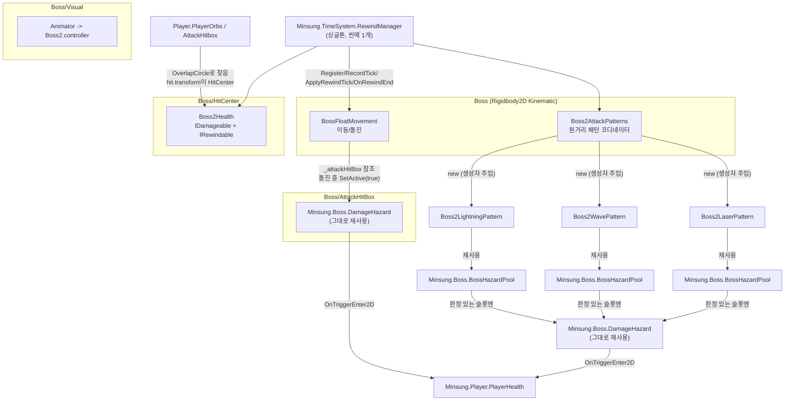
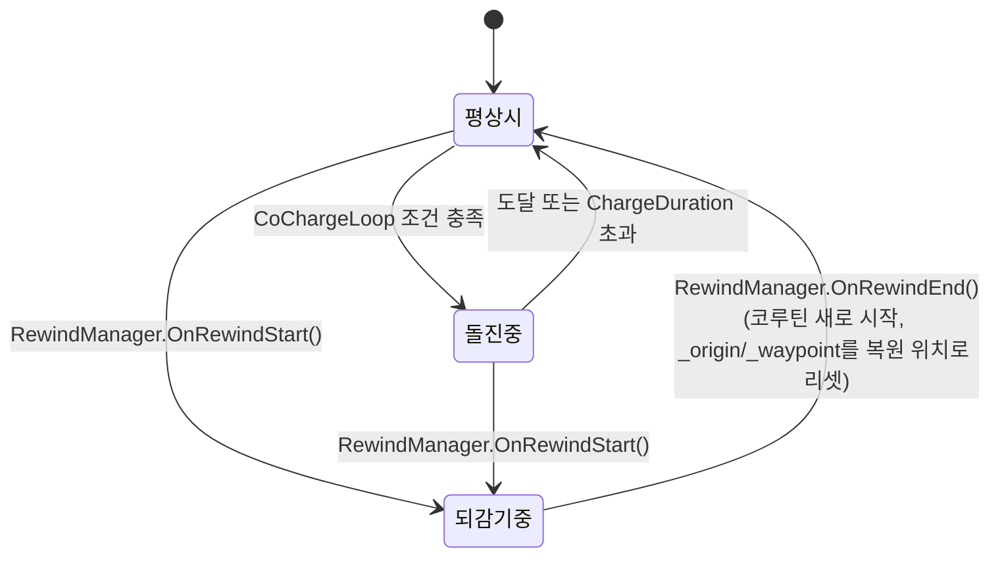

# Boss2 코드 가이드 (디버깅용)

> 대상: `claude/boss2-handover.md`가 "뭐가 됐고 뭐가 남았는지"라면, 이 문서는 **"코드가 실제로 어떻게 동작하는지"**에 집중한다.
> 목적: 진욱이 이 코드를 직접 읽고 디버깅할 수 있게, 파일 간 호출 관계 / 상태 변수 의미 / 자주 나는 함정을 정리.

---

## 1. 전체 그림 — 오브젝트/컴포넌트 관계



**핵심**: `Boss2*` 클래스들은 서로 직접 참조하지 않는다. 전부 `Boss2DataSO`(밸런싱 값)를 통해서만 간접적으로 엮여 있고, `RewindManager`/`BossHazardPool`/`DamageHazard`/`IDamageable` 같은 **Minsung 쪽 공용 인프라를 소비만** 한다.

---

## 2. 파일별 설명

### 2.1 `Boss2DataSO.cs` — 그냥 숫자 창고

로직 없음. `[SerializeField]` + 읽기전용 프로퍼티만 있는 순수 데이터 클래스. 인스펙터에서 `Assets/08.Data/Boss2/Boss2DB.asset`을 열면 실제 튜닝값을 볼 수 있다.

디버깅 팁: **코드의 필드 기본값과 에셋에 저장된 실제 값이 다를 수 있다** (에셋이 항상 우선). 이상한 수치로 동작하면 코드가 아니라 `Boss2DB.asset` 인스펙터부터 확인할 것.

### 2.2 `BossFloatMovement.cs` — 이동의 심장부

**좌표 변수가 여러 개라 헷갈리기 쉽다. 이게 제일 중요한 부분:**

| 변수 | 의미 | 언제 바뀌나 |
|---|---|---|
| `_baseX`, `_baseY` | "지금 이 보스가 서 있다고 치는" 기준 위치. 배회/돌진 로직이 매 틱 갱신 | `MoveTowardWaypoint()`(배회 중) 또는 `UpdateCharge()`(돌진 중)에서 |
| `_origin` | 배회 반경의 중심. 플레이어를 따라 서서히 이동 | `FollowTarget()`에서 매 틱 아주 조금씩 |
| `_waypoint` | 지금 걸어가고 있는 목표 지점 (`_origin` 반경 안 랜덤) | `CoRoamLoop()`가 도착할 때마다 새로 뽑음 |
| `_chargeTarget` | 돌진 시작 순간 스냅샷한 목표 지점 (돌진 중엔 안 바뀜) | `CoBodySlam()` 시작 시 1회만 |
| 최종 렌더 위치 (`_rb.position` / `transform.position`) | `_baseX/_baseY` + 사인파 흔들림(`offsetX/offsetY`) | `FixedUpdate()` 매 틱 |

즉 **"보스가 어디 있는지"는 3단계로 계산된다**: `_origin`(어디를 중심으로 배회할지) → `_baseX/_baseY`(그 중심 반경 안에서 지금 어디로 걸어가고 있는지) → 최종 위치(그 자리에서 사인파로 살짝 흔들림). 디버깅할 때 "보스가 이상한 데 있다"면 이 세 단계 중 어디가 잘못됐는지부터 나눠서 봐야 한다.

**FixedUpdate() 분기 구조:**

```
FixedUpdate()
├─ _dataSo == null 이거나 _isRewinding 이면 → 아무것도 안 함 (return)
├─ _isCharging == true 이면 → UpdateCharge()만 실행 (배회/추적/흔들림 다 건너뜀)
└─ 그 외(평상시) → FollowTarget() + MoveTowardWaypoint() + 흔들림 오프셋 계산
   └─ 마지막에 항상: ClampHeightCeiling() → _rb.MovePosition(최종 위치)
```

**코루틴 2개가 병렬로 돈다:**
- `CoRoamLoop()` — 계속 도는 배회 루프. `_isCharging`과 무관하게 항상 돌고 있다(단, 돌진 중엔 `FixedUpdate`가 `MoveTowardWaypoint()`를 안 불러서 실제 이동엔 영향 없음 — 루프 자체는 "도착 대기" 상태로 멈춰있는 게 아니라, `Vector2.Distance` 체크가 통과 못 해서 `while` 안에서 계속 `yield return null`만 하고 있을 뿐).
- `CoChargeLoop()` — `ChargeCooldown`마다 깨어나서 조건(플레이어가 `ChargeRange` 안) 맞으면 `CoBodySlam()` 실행.

**되감기(`IRewindable`) 관련 상태 흐름:**



`OnRewindStart()`가 호출되면 `StopMovementLoops()`로 두 코루틴을 전부 죽인다. `OnRewindEnd()`에서 `StartCoroutine`으로 다시 새로 만든다 — 즉 **되감기 전에 진행 중이던 배회 목적지나 돌진은 그냥 사라지고, 되감긴 위치에서 완전히 새로 시작한다.** ("이동 패턴 자체"는 되감기되지 않고, "위치"만 되감긴다.)

### 2.3 `Boss2Health.cs` — 제일 단순한 파일

`IDamageable`(피해 받기) + `IRewindable`(체력 되감기) 두 인터페이스만 구현. `_currentHealth` 하나 왔다갔다 하는 게 전부라 버그 날 일이 적다. 문제가 생긴다면 대개:
- `_dataSo`가 인스펙터에 연결이 안 됐다 → `MaxHealth`가 0이 되고 `Start()`에서 `_rewindBuffer`도 안 만들어짐(→ `RegisterTick` 자체가 등록 안 됨, 조용히 무시됨)
- `TakeDamage`가 `false`를 반환하는데 이유를 모르겠다 → `_isRewinding`이 `true`로 박혀있는 경우 확인 (정상이면 되감기 끝나고 자동으로 `false`가 된다. 안 풀리면 **RewindManager 브로드캐스트가 도중에 끊긴 것** — 아래 4장 참고)

### 2.4 `BossHealthBarUI.cs` — UI

`Boss2Health.OnHealthChanged` 이벤트를 구독해서 `Slider.value`만 갱신. `Start()`에서 인스펙터에 `_boss`가 안 비어 있으면 그거 쓰고, 비어 있으면 `FindAnyObjectByType<Boss2Health>()`로 자동 연결. **씬에 `Boss2Health`가 2개 이상 있으면 어느 쪽에 붙을지 예측 불가** — 지금은 1개뿐이라 문제없음.

### 2.5 `Boss2AttackPatterns.cs` + 패턴 3종

`Boss2AttackPatterns`는 순수 코디네이터 — 자기 로직은 없고 `Start()`에서 패턴 3개를 `new`로 만들어서 `Play()`만 호출한다. 각 패턴(`Boss2LightningPattern`/`Boss2WavePattern`/`Boss2LaserPattern`)은 서로 완전히 독립된 클래스로, MonoBehaviour가 아니라 **순수 C# 클래스**다 (그래서 `IRewindable`을 직접 구현하지 않고, `Boss2AttackPatterns`가 대신 등록해서 `Stop()`/`Play()`만 대신 호출해준다).

세 패턴의 코드 구조는 거의 동일하다 (원본 `BossLightningPattern`/`Phase2State`/`Phase3State`를 그대로 본떴기 때문):

```
Play() → StartCoroutine(Co___Loop())
  └─ Co___Loop(): while(true) { yield return 간격 대기; 예고+강타 코루틴 하나 더 시작; }
       └─ Co예고및강타(): BossHazardPool.Alloc(판정 없음) → 대기 → Free()
                          → BossHazardPool.Alloc(판정 있음) → 대기/프레임순환 → Free()
Stop() → 루프 코루틴 정지 + _pool.FreeAll() (떠 있는 판정/연출 전부 회수)
Dispose() → Stop() + _pool.Dispose() (풀 오브젝트 자체를 파괴, OnDestroy에서만 호출)
```

**`BossHazardPool`은 Minsung 코드지만 완전히 범용이라 그대로 갖다 썼다.** 슬롯 하나가 "판정+스프라이트+파티클"을 다 갖고 있고, `Alloc`/`Free`로 재사용한다. 여기서 자주 헷갈리는 것:
- `Alloc(..., hasCollider: false)` = 예고 단계(보이기만, 안 맞음)
- `Alloc(..., hasCollider: true, damageHalves)` = 강타 단계(실제 판정)
- 풀이 꽉 차면(`POOL_SIZE`개 동시 사용 중) `Alloc`이 `-1`을 반환하고, 그 발은 그냥 생략된다(예외 안 남).

**레이저만 다르다**: 스프라이트 프레임 순환이 아니라 `Resources.Load<Material>("Phase3LaserBeamMat")`로 불러온 **쉐이더 머티리얼**을 씀. 문제 생기면 `Assets/Resources/Phase3LaserBeamMat.mat`이 실제로 존재하는지, 쉐이더(`Minsung/Phase3LaserBeam`)가 컴파일 에러 없이 살아있는지부터 확인.

---

## 3. 시나리오별 코드 흐름 추적

### 3.1 "오브 공격이 보스한테 명중했을 때"

```
PlayerOrbs.TryAttackNearest()
  └─ FindNearestTarget(): Physics2D.OverlapCircle로 IDamageable 있는 콜라이더 탐색
      └─ hit.transform 을 target으로 저장 (★ 이게 HitCenter다, Boss 루트가 아니라)
  └─ SelectOrb().Attack(target, onHit)
      └─ OrbController.CoAttack(): target.position으로 계속 돌진, OrbHitDistance 안 들어오면 onHit() 실행
          └─ onHit 콜백 안에서: damageable.TakeDamage(dmg, source, attacker)
              └─ Boss2Health.TakeDamage() 실행 → _currentHealth 감소 → OnHealthChanged 발생
                  └─ BossHealthBarUI.Redraw() → Slider.value 갱신
```

**왜 `HitCenter`가 필요했는지**: `hit.transform`은 콜라이더가 붙은 오브젝트 자체다. 콜라이더가 `Boss` 루트에 있으면 `hit.transform` == `Boss.transform`이라 오브가 루트 피벗으로 날아간다(시각적으로 틀어진 위치). 콜라이더+`Boss2Health`를 `HitCenter`(시각적 중심)로 옮겨서 해결한 것 — 즉 **"어디에 맞는지"는 콜라이더가 물리적으로 어느 오브젝트에 붙어있는지로 결정된다.**

### 3.2 "몸통박치기가 플레이어를 때렸을 때"

```
CoChargeLoop() 쿨다운 종료, 거리 조건 통과
  └─ CoBodySlam()
      ├─ _chargeTarget = _target.position (스냅샷)
      ├─ ChargeTelegraphTime만큼 대기 (제자리 정지)
      ├─ _isCharging = true, _attackHitBox.SetActive(true)
      │    └─ FixedUpdate()가 UpdateCharge()로 전환 → _baseX/_baseY가 _chargeTarget으로 등속 이동
      ├─ (도달 또는 ChargeDuration 초과까지 반복)
      └─ _attackHitBox.SetActive(false), _isCharging = false
```

`AttackHitBox`가 켜져 있는 동안, 그 위에 붙은 `Minsung.Boss.DamageHazard.OnTriggerEnter2D`가 플레이어 콜라이더와 겹치면 자동으로 `PlayerHealth.TakeDamageHalves()`를 호출한다 — **우리 코드는 히트박스를 켜고 끄기만 하고, 실제 피해 판정은 전부 `DamageHazard`(Minsung 코드, 그대로 재사용)가 담당한다.**

### 3.3 "R키로 되감기를 눌렀을 때" (전체 체인)

```
PlayerInput → PlayerRewind.OnRewindStart() 등 → RewindManager.StartRewind()
  └─ 등록된 모든 IRewindable에 OnRewindStart() 방송 (역순)
      ├─ BossFloatMovement.OnRewindStart(): 코루틴 정지, _isRewinding=true
      ├─ Boss2Health.OnRewindStart(): _isRewinding=true (TakeDamage 차단 시작)
      ├─ Boss2AttackPatterns.OnRewindStart(): 세 패턴 Stop() (판정/연출 전부 회수)
      └─ Minsung.Player.PlayerRewind.OnRewindStart() 등등...

  └─ 매 프레임 StepRewind() → 모든 IRewindable.ApplyRewindTick(orderedIndex) 방송 (역순, 인덱스 감소)
      ├─ BossFloatMovement: 기록된 위치로 순간이동
      └─ Boss2Health: 기록된 체력으로 복원 (+ UI 갱신)

  └─ 마지막에 FinishRewind() → 모든 IRewindable.OnRewindEnd(0) 방송 (역순)
      ├─ BossFloatMovement: 최종 위치 적용, _origin/_waypoint 리셋, 코루틴 재시작
      ├─ Boss2Health: 최종 체력 적용, 버퍼 비움, _isRewinding=false
      └─ Boss2AttackPatterns: 세 패턴 Play() (루프 재시작)
```

**중요 — `RewindManager`의 이 방송 루프엔 예외 처리가 없다.** 등록된 리와인더 중 하나가 `OnRewindEnd` 안에서 예외를 던지면, **그 뒤 순서로 등록된 리와인더는 아예 콜백을 못 받는다.** 실제로 이것 때문에 Map3에 `ClonePool`이 없어서 `Minsung.Player.PlayerRewind`가 예외를 던지고, 그 여파로 `Boss2Health.OnRewindEnd`가 호출 안 돼서 체력이 안 풀리는 버그가 있었다(지금은 씬에 `ClonePool` 추가해서 해결됨).

**디버깅 팁**: "되감기 이후 뭔가 안 풀린다" 싶으면
1. 콘솔에서 `NullReferenceException` 등 되감기 중 예외부터 확인 (있으면 그게 원인, 우리 코드가 아니어도 우리 코드까지 안 불려서 영향받음)
2. `Boss2Health`/`BossFloatMovement`의 `_isRewinding` 필드가 `true`에 박혀있으면 `OnRewindEnd`가 안 불린 것

---

## 4. 자주 나는 함정 체크리스트

| 증상 | 원인 후보 | 확인할 곳 |
|---|---|---|
| 보스가 안 움직인다 | `_dataSo` 미연결 | `BossFloatMovement` 인스펙터의 `_dataSo` |
| 보스가 뚝뚝 끊겨 보인다 | `Boss`에 `Rigidbody2D`가 없거나 `interpolation`이 꺼짐 | 인스펙터 확인, 또는 `Awake()`가 정상 실행됐는지 |
| 오브 공격이 이상한 위치에 맞는다 | 콜라이더가 `HitCenter`가 아니라 `Boss` 루트나 다른 오브젝트에 있음 | `HitCenter`의 `BoxCollider2D`/`Boss2Health` 존재 여부 |
| 플레이어가 보스한테 밀린다 | `Boss` 루트 `BoxCollider2D.isTrigger`가 꺼져있음 | `Boss`의 `BoxCollider2D` |
| 공격해도 반응이 없다 | **Unity 에디터가 Pause 상태** (제일 흔함) | 에디터 상단 Pause 버튼 |
| 낙뢰가 빨갛게/이상하게 보인다 | `Boss2DB.asset`의 `_lightningColor` 등 색상값이 스프라이트 원색과 안 맞음(흰색이어야 원색 유지) | `Boss2DB.asset` 인스펙터 |
| 되감기 후 체력/위치가 안 풀린다 | 되감기 브로드캐스트 중 다른 곳(Player 등)에서 예외 발생 | 콘솔 에러, 3.3절 참고 |
| Idle 말고 다른 애니메이션이 안 나온다 | `Boss2.controller`에 State가 Idle 하나뿐 (의도된 상태, 미구현) | `Assets/07.Animator/Boss2/Boss2.controller` |
| 몸통박치기가 안 나간다 | `ChargeCooldown`(기본 6초) 안 지났거나 플레이어가 `ChargeRange` 밖 | `Boss2DB.asset`의 몸통박치기 값 |

---

## 5. 아직 없는 것 (코드 이해에 필요한 전제)

- **결정 로그가 없다**: 배회 웨이포인트, 돌진 타이밍, 낙뢰/강타/레이저 발사 시점은 전부 `Random`으로 그때그때 결정되고 기록되지 않는다. 되감기해도 "그 순간에 뭘 하고 있었는지"는 재현 안 되고 위치/체력만 되감긴다.
- **페이즈 개념이 없다**: `Boss2Health`는 그냥 0까지 깎이는 단일 피통. 원본처럼 페이즈 경계에서 동결/기믹이 도는 로직이 없다.
- 자세한 TODO 목록은 `claude/boss2-handover.md` 9장 참고.
