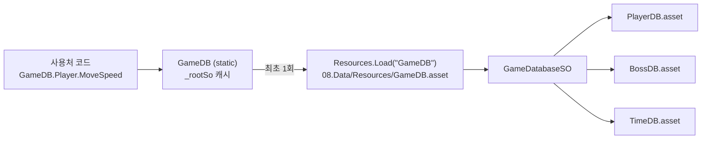

# GameDB - ScriptableObject 밸런싱 데이터 시스템 (인수인계 문서)

- 작성일: 2026-07-11 (Constants -> SO DB 이관 완료 시점 기준) / 갱신: 2026-07-22 (Lp·Potion·Boss2DataSO 반영, BossDataSO 필드 최신화, 소비자 목록 재확인)
- 대상 독자: 이 시스템을 이어받는 개발자, 그리고 그 개발자의 AI 코딩 에이전트(Claude Code 등)
- 이 문서는 자기완결적으로 작성됐다. 이 문서만 읽어도 구조/사용법/확장 절차를 파악할 수 있다
- AI 에이전트: 섹션 10 "AI 에이전트 작업 규칙"이 기계용 요약이고, 나머지 섹션이 그 근거다

## 1. 개요 (TL;DR)

- 밸런싱 수치(이동속도/데미지/쿨타임/색상 등)는 코드가 아니라 **ScriptableObject 에셋**에 저장한다
- 코드에서는 정적 접근자 `GameDB.Player.MoveSpeed` 형태로 읽는다 (네임스페이스 `Minsung.Common.Data`)
- 수치 튜닝은 Unity 인스펙터에서 DB 에셋을 수정한다 - **코드 수정/재컴파일 불필요**
- 입력 키, 판정 epsilon, enum 연동 상수 같은 **코드 계약값만** `Constants.*.cs`에 남는다

기존에는 모든 수치가 `Constants.*.cs`의 `const`였다. 수치 하나 바꿀 때마다 재컴파일이 필요하고, 컴포넌트마다 SerializeField 미러가 생겨 진실의 원천이 흩어지는 문제가 있어 2026-07-11에 SO DB로 이관했다. 이 과정에서 `Constants.time.cs`는 전부 이관되어 **삭제**됐다.

## 2. 구조

### 2.1 스크립트 - `Assets/01.Scripts/00.Common/Data/`

| 파일 | 역할 |
|---|---|
| `GameDB.cs` | 정적 접근자. `GameDB.Player` / `GameDB.Boss` / `GameDB.Time`. 루트 에셋을 첫 접근 시 1회 `Resources.Load` 후 static 캐싱 |
| `GameDatabaseSO.cs` | 루트 DB. 도메인 SO 3개를 SerializeField로 묶는 컨테이너. `RESOURCES_PATH = "GameDB"` |
| `PlayerDataSO.cs` | 플레이어 밸런싱 (이동/공격·차지/체력·사망/넉백·플래시/오브/시각효과) |
| `BossDataSO.cs` | 보스 밸런싱 (피통·페이즈/본체/분신/낙뢰/감정/1페이즈 기믹/2페이즈 장풍/3페이즈 레이저) |
| `TimeDataSO.cs` | 타임시스템 밸런싱 (리와인드/분신/슬로우/MP) |
| `LpDataSO.cs` | LP(수집 재화) 밸런싱 (드랍/자석 픽업/풀) |
| `PotionDataSO.cs` | 포션(회복 소비 아이템) 밸런싱 (드랍/자석 픽업/풀/소지·사용) |
| `Boss2DataSO.cs` | **(GameDB 트리 밖 독립 DB)** Boss2(Map3, 3~4P, 진욱) 전용 밸런싱. `GameDatabaseSO`에 슬롯이 없고 `GameDB.Boss2` 접근자도 없다 - 컴포넌트 인스펙터에 직접 드래그해서 쓴다. 필드 개요는 섹션 5.6 |

모두 네임스페이스 `Minsung.Common.Data` (민성 소유 - 구조 변경 전 소유자 확인, 필드 추가는 섹션 6 절차대로 누구나 가능).
`GameDatabaseSO`의 도메인 슬롯은 **5종**(`_playerSo`/`_bossSo`/`_timeSo`/`_lpSo`/`_potionSo`)이다. `Boss2DataSO`는 여기 포함되지 않는 독립 SO다.

### 2.2 에셋 - `Assets/08.Data/`

| 에셋 경로 | 타입 | 생성 메뉴 (Assets > Create) |
|---|---|---|
| `08.Data/Resources/GameDB.asset` | `GameDatabaseSO` | TheLastRewind > GameDB > GameDB (Root) |
| `08.Data/Player/PlayerDB.asset` | `PlayerDataSO` | TheLastRewind > GameDB > PlayerDB |
| `08.Data/Boss/BossDB.asset` | `BossDataSO` | TheLastRewind > GameDB > BossDB |
| `08.Data/Time/TimeDB.asset` | `TimeDataSO` | TheLastRewind > GameDB > TimeDB |
| `08.Data/Lp/LpDB.asset` | `LpDataSO` | TheLastRewind > GameDB > LpDB |
| `08.Data/Potion/PotionDB.asset` | `PotionDataSO` | TheLastRewind > GameDB > PotionDB |

- **루트만 Resources 폴더에 있다.** 도메인 에셋은 루트가 참조하므로 빌드에 의존성으로 자동 포함된다 (Resources 팽창 방지 + 폴더 구분 관리)
- `GameDB.asset` 인스펙터의 `_playerSo` / `_bossSo` / `_timeSo` / `_lpSo` / `_potionSo` 슬롯에 도메인 에셋이 연결돼 있어야 한다 (현재 연결 완료 상태)
- 같은 `08.Data/Resources/`에 있는 `SoundDB.asset` / `AchievementDatabase.asset`은 별도 시스템(사운드/업적)이며 GameDB 소속이 아니다

### 2.3 로드 흐름



- 도메인 리로드 OFF 세팅 대비: `GameDB`에 `[RuntimeInitializeOnLoadMethod(SubsystemRegistration)]`로 static 캐시를 리셋하는 `ResetStatics()`가 있다. 새 static 캐시를 GameDB에 추가하면 여기서 같이 리셋할 것
- 루트 에셋이 없으면 `Debug.LogError("[GameDB] 루트 DB 에셋이 없습니다...")`를 출력한다

## 3. 사용법

### 3.1 값 읽기 - 표준 패턴

```csharp
using Minsung.Common.Data; // GameDB 접근에 필요

public class SomeComponent : MonoBehaviour
{
    private float _moveSpeed;
    private WaitForSeconds _waitAttack;

    private void Awake()
    {
        // 여러 값을 읽을 땐 지역 변수로 캐싱 - SO 변수는 So 어미
        PlayerDataSO playerSo = GameDB.Player;

        _moveSpeed  = playerSo.MoveSpeed;
        _waitAttack = new WaitForSeconds(GameDB.Boss.AttackCooldown); // 코루틴 대기는 필드 캐싱
    }
}
```

- **Awake 이후에만 접근한다** (아래 금지 패턴 참고)
- 프로젝트 관례는 Awake에서 필드로 캐싱. 매 프레임 `GameDB.X.Y` 직접 읽기도 동작은 하지만(내부 캐시 반환) 사용처가 많으면 캐싱한다. 단, 캐싱하면 플레이 중 인스펙터 튜닝이 실시간 반영되지 않는 트레이드오프가 있다

### 3.2 금지 패턴

```csharp
// 금지 1: MonoBehaviour 필드 초기화식/생성자에서 GameDB 호출
//        Resources.Load가 생성자 타이밍에 금지돼 UnityException 발생
private float _moveSpeed = GameDB.Player.MoveSpeed;

// 금지 2: 밸런싱 값의 SerializeField 미러
//        진실의 원천이 DB와 인스펙터 두 곳으로 갈라진다 - DB에서만 읽을 것
[SerializeField] private float _moveSpeed = 5f;

// 금지 3: static 초기화식에서 GameDB 호출 (타이밍 보장 없음)
private static readonly WaitForSeconds _wait = new WaitForSeconds(GameDB.Boss.AttackCooldown);
//        -> 인스턴스 readonly 필드로 바꾸고 Awake/생성자(일반 클래스)에서 생성 (Phase1~3State 참고)

// 금지 4: 리와인드 버퍼 용량 직접 계산 (참여자 간 인덱스 어긋남)
int capacity = Mathf.CeilToInt(GameDB.Time.RecordSeconds / Time.fixedDeltaTime);
//        -> 반드시 RewindManager.TickCapacity를 쓴다
```

### 3.3 수치 튜닝 (에디터)

1. Project 창에서 `Assets/08.Data/Player|Boss|Time/*DB.asset` 선택
2. 인스펙터에서 값 수정 - Header 그룹과 단위 주석(툴팁 아님, 소스 주석)이 기준
3. 플레이 중 수정도 반영된다 (Awake 캐싱된 값 제외)

### 3.4 Unity SO 특성 주의 (함정)

- **플레이 중 SO 값 변경은 플레이 종료 후에도 유지된다.** 씬 오브젝트와 달리 되돌아가지 않으므로, 실험 후 원복하거나 버전 관리 diff로 확인할 것
- **코드의 필드 기본값은 "에셋 생성/신규 필드 추가 시점"에만 적용된다.** 이미 존재하는 에셋의 기존 필드는 코드 기본값을 바꿔도 변하지 않는다 (직렬화된 값이 우선). 값을 바꾸려면 에셋 인스펙터에서 바꿀 것
- 클래스에 새 필드를 추가하면 기존 에셋에는 다음 역직렬화 때 코드 기본값이 들어간다 (기존 필드 값은 유지)
- PlayerDB의 `MoveSpeed 2` / `JumpForce 6`은 이관 당시 Player.prefab의 라이브 튜닝값을 베이크한 것이다 (과거 상수 5/9와 다름 - **에셋 값이 진실**)
- 프리팹/씬에 남아 있는 옛 직렬화 필드(`_moveSpeed` 등 제거된 SerializeField)는 Unity가 무시하므로 무해하다

## 4. GameDB vs Constants 판단 기준

새 수치를 어디에 둘지는 이 질문 하나로 결정한다: **"기획자가 인스펙터에서 바꿔도 코드가 깨지지 않는가?"**

| 구분 | 위치 | 예 |
|---|---|---|
| 밸런싱 값 (튜닝 대상) | `*DataSO` (GameDB) | 이동속도, 데미지, 쿨타임, 지속시간, 색상, 오프셋 |
| 코드 계약값 (바꾸면 코드/에셋이 깨짐) | `Constants.*.cs` | 입력 키, 축 이름, 판정 epsilon, enum 연동 개수, 애니 방향 부호 |

### Constants에 남긴 값과 이유 (`00.Common/Constants/`, 네임스페이스 `Minsung.Common`)

| 상수 | 남긴 이유 |
|---|---|
| `Constants.Player.KEY_*`, `AXIS_HORIZONTAL` | 입력 바인딩 - 코드 계약 |
| `Constants.Player.GROUND_CHECK_EXTRA`, `FACING_MIN_SPEED` | 물리 판정 epsilon - 튜닝 대상 아님 |
| `Constants.Player.HALVES_PER_HEART` (= 2) | 하트 1칸 = 반칸 2개 구조 상수. 바꾸면 체력 로직 전체가 깨짐 |
| `Constants.Player.ANIM_DIR_FORWARD/REVERSE` (1/-1) | 애니메이터 재생 방향 부호 |
| `Constants.Combat.MIN_DAMAGE`, `CRITICAL_MULTIPLIER`, `HIT_STOP_DURATION` | 전투 공식 상수 |
| `Constants.Combat.ENEMY_*` (7개) | 몬스터 FSM 기본값 + 배치별 인스펙터 튜닝 전제라 의도적으로 유지. 몬스터 종류가 늘면 `MonsterDataSO` 분리 권장 (섹션 6.2 절차) |
| `Constants.Combat.GIMMICK_LASER_COLOR_COUNT` (= 3) | `LaserColor` enum 개수와 일치해야 하는 구조 상수 |
| `Constants.audio/camera/interactive/item/ui` | 타 도메인 계약값 파일 - 이번 이관 범위 밖 |

## 5. 도메인별 필드 개요

전체 필드는 소스가 진실이다 (필드마다 단위/의미 주석 있음). 아래는 그룹과 프로퍼티 이름 색인이다.

### 5.1 PlayerDataSO (`GameDB.Player`)

| 그룹 | 프로퍼티 |
|---|---|
| 이동 | MoveSpeed, JumpForce, MaxJumps, GravityScale |
| 공격 | AttackDamage, ChargeDamageMult, ChargeTime, AttackCooldown, ProjectileSpeed, AttackFlashTime, AttackHitRadius, AttackHitLifetime |
| 체력/사망 | MaxHearts, InvincibleDuration, DeathRespawnDelay |
| 회피 무적 (공간찢기 파훼) | DodgeInvincibleDuration, DodgeInvincibleCooldown |
| 피격 리액션 | KnockbackForceX/Y, KnockbackStunTime, HitFlashDuration, HitFlashColor, HitShakeForce, HitShakeDuration, HitVignetteAlpha, HitVignetteDuration, HitStopOnDamagedDuration |
| 오브 | OrbAttackRange, OrbFollowSmooth, OrbAnchorOffset, OrbWanderRadius, OrbWanderSpeed, OrbSpacing, OrbCount, OrbDashSpeed, OrbHitDistance, OrbDashTimeout, OrbSize, OrbColor, OrbGlowColor/Intensity, OrbPulseSpeed/Amount, OrbTrailColor/Duration/Width/MinVertexDistance |
| 시각 효과 | RewindTintColor, ChargingColor, ChargeReadyColor |
| **계산 프로퍼티** | `MaxHeartHalves` = MaxHearts x HALVES_PER_HEART (반칸 단위 최대 체력, 체력 로직은 이 값 사용) |

### 5.2 BossDataSO (`GameDB.Boss`)

> `BossDataSO`는 **Boss1(민성, Map2 1~2페이즈)** 용이다. Boss2(Map3, 3~4P)는 별도 `Boss2DataSO`(섹션 5.6)를 쓴다.

| 그룹 | 프로퍼티 |
|---|---|
| 공통 | TotalHealth(**이 씬이 담당하는 페이즈 구간 총 피통** - `BossController._finalPhaseIndex+1`로 균등 분할), TimeLimit(600초 - 실시간, 초과 시 플레이어 즉사), AttackHalves, CloneAttackHalves, ReflectHalves |
| 본체 근거리 (2페이즈~) | MoveSpeed, AttackRange, AttackCooldown, CastCooldown, AttackActiveTime, CombatHitboxSize, CombatHitboxCenter |
| 본체 점프/회피 | JumpCooldown, JumpArcHeight, JumpLandActiveTime, StuckEscapeDelay, DodgeCooldown, DodgeTriggerRange, DodgeBackDistance, DodgeDuration |
| 분신 (1페이즈 2체) | CloneHealth, CloneCount, CloneAttackRange, CloneAttackCooldown, CloneActionOffset, CloneAttackActiveTime, CloneMoveSpeed, CloneEntranceLeapHeight, CloneCrowdAvoidHorizontalRange, CloneCrowdAvoidVerticalRange |
| 낙뢰 (전 페이즈) | LightningInterval, LightningTelegraphTime/Height, LightningActiveTime, LightningStunDuration, LightningDamageHalves, LightningWidth/Height, LightningGroundEmbed, LightningPlayerRadius, LightningRatePinkMult, LightningRateBlueMult, LightningColor, LightningTelegraphColor, LightningStrikeSprites, LightningFrameInterval, LightningParticleSize/Colors |
| 감정 | ConfusionInterval, ConfusionDuration, HeartPickupHeight, EmotionInterval |
| 죽음 연출 | DeathLightDelay, DeathCircleDelay, DeathCircleLaunchDirection/Speed/Duration, DeathCircleFloatDuration/Amplitude/Frequency, DeathCircleReturnSpeed |
| 1페이즈 즉사 기믹 | GimmickLaserCount, GimmickSafeZoneAlpha, GimmickTelegraphTime, GimmickLaserActiveTime, GimmickLaserHeight, GimmickRefireDelay, GimmickJudgeInterval |
| 2페이즈 장풍 | Phase2WaveInterval, Phase2WaveWidth/Height, Phase2WaveGroundEmbed, Phase2WaveTelegraphTime, Phase2WaveActiveTime, Phase2WaveFrameInterval, Phase2WaveActiveFrameCount, Phase2WaveColor, Phase2WaveStrikeSprites, Phase2WaveParticleSize/Colors |
| 3페이즈 레이저 | Phase3LaserInterval, Phase3LaserWarningTime, Phase3LaserBlinkInterval, Phase3LaserActiveTime, Phase3LaserRetractTime, Phase3LaserThickness, Phase3LaserWarningThickness, Phase3LaserMaxHeight, Phase3LaserWarningColor, Phase3LaserColor, Phase3LaserFlowParticleSize/Speed/Rate/Colors |

- 하트 차감은 반칸(Halves) 단위: AttackHalves 2 = 한 칸, CloneAttackHalves 1 = 반 칸
- **페이즈 1개 분량 피통은 `BossController.PhaseHealthSpan`**(= `GameDB.Boss.TotalHealth / (_finalPhaseIndex + 1)`)에서 계산한다. `BossDataSO`에는 `PhaseCount` 필드가 없다(과거 있던 필드 제거됨) - 이 씬이 담당하는 페이즈 수는 `BossController._finalPhaseIndex`가 정한다.
- `TODO: 밸런싱` 주석이 붙은 필드는 기획 미확정 임시값
- **주의: 현재 BossDB.asset의 TotalHealth는 1500이다 (테스트용 축소값).** 코드 기본값은 16000(이 씬=Map2가 담당하는 페이즈 구간 총 피통). 실 밸런스 테스트 전 인스펙터에서 확정할 것

### 5.3 TimeDataSO (`GameDB.Time`)

| 그룹 | 프로퍼티 |
|---|---|
| 타임리와인드 | RecordSeconds(기록 길이 초), RewindDuration(역재생 연출 초) |
| 분신 | MaxCloneCount, CloneAttackFlashTime, CloneTintColor |
| 슬로우 | SlowTimeScale (Range 0.1~1, fixedDeltaTime 보정은 SlowMotionController가 자동) |
| MP | MaxMp, MpRegenPerSec, RewindMpCost, SlowMpCostPerSec, KillMpRestore |

- **`RecordSeconds`는 직접 쓰지 말 것.** 버퍼 용량은 반드시 `RewindManager.TickCapacity` 경유 (리와인드 참여자 전원의 버퍼 인덱스 정합성)

### 5.4 LpDataSO (`GameDB.Lp`)

| 그룹 | 프로퍼티 |
|---|---|
| 드랍 | DropChance |
| 자석 픽업 | MagnetRadius, MagnetSpeed, CollectRadius |
| 풀 | PoolSize |

### 5.5 PotionDataSO (`GameDB.Potion`)

| 그룹 | 프로퍼티 |
|---|---|
| 드랍 | DropChance |
| 자석 픽업 | MagnetRadius, MagnetSpeed, CollectRadius |
| 풀 | PoolSize |
| 소지/사용 | MaxCarryCount(최대 소지 개수), HealHalves(1개 사용 시 회복량, 반칸 단위) |

- LP와 동일하게 몬스터 처치 드랍 + 자석 픽업 패턴(`LpManager`/`LpPickupPool` 참고 구현)을 그대로 재사용한다. 소지 개수는 `MaxCarryCount`로 상한을 두고(가득 차면 드랍을 줍지 못함), 사용은 `PlayerInput`의 `Constants.Player.KEY_USE_POTION`(Q) 입력 -> `PotionManager.TryUsePotion()` -> `PlayerHealth.Heal(HealHalves)`

### 5.6 Boss2DataSO (`GameDB` 트리 밖 - 독립 DB)

Boss2(Map3, 3~4페이즈, 진욱)의 전용 밸런싱 DB. **`GameDatabaseSO`에 연결하지 않고 `GameDB.Boss2` 접근자도 없다** - Boss2 컴포넌트(`BossFloatMovement`/`Boss2Health`/`Boss2AttackPatterns` 등) 인스펙터에 `[SerializeField]`로 직접 드래그해서 쓴다. 상세 사용은 `claude/boss.md` 5장.

| 그룹 | 프로퍼티 |
|---|---|
| 이동/배회 | MoveSpeed, MoveSmoothTime, RoamRadius, RoamArriveThreshold, RoamWaitMin/Max, MaxHeightMargin, FollowSpeed |
| 체력/페이즈 | MaxHealth, PhaseCount(3~4P) |
| 돌진(몸통박치기) | ChargeCooldown, ChargeRange, ChargeTelegraphTime, ChargeSpeed, ChargeDuration, ChargeArriveThreshold |
| 부유 흔들림 | VerticalAmplitude/Period, HorizontalAmplitude/Period |
| 감정 | ReflectHalves, EmotionInterval, LightningRatePink/BlueMult, ConfusionInterval, ConfusionDuration, HeartPickupHeight |
| 낙뢰 | LightningInterval, LightningTelegraphTime/Height, LightningActiveTime, LightningStunDuration, LightningDamageHalves, LightningWidth/Height, LightningGroundEmbed, LightningPlayerRadius, LightningColor, LightningTelegraphColor, LightningStrikeSprites, LightningFrameInterval, LightningParticleSize/Colors |
| 강타(Wave) | WaveInterval, WaveWidth/Height, WaveGroundEmbed, WaveTelegraphTime, WaveActiveTime, WaveFrameInterval, WaveActiveFrameCount, WaveDamageHalves, WaveColor, WaveStrikeSprites, WaveParticleSize/Colors |
| 레이저 | LaserInterval, LaserWarningTime, LaserBlinkInterval, LaserActiveTime, LaserRetractTime, LaserThickness, LaserWarningThickness, LaserMaxHeight, LaserDamageHalves, LaserWarningColor, LaserColor, LaserFlowParticleSize/Speed/Rate/Colors |
| 공간찢기 (4P 즉사기) | SpaceTearHealthPercent, SpaceTearBannerTime, SpaceTearTelegraphTime, SpaceTearDashCount, SpaceTearDashSpeed, SpaceTearDashInterval, SpaceTearPlayerDashSpeed, SpaceTearPlayerWarningTime, SpaceTearHitboxSize, SpaceTearTelegraphThickness/Blink/Color |
| 손아귀 (4P) | GrabCooldown, GrabChance, GrabRange, GrabTelegraphTime, GrabHandSpeed, GrabReach, GrabHitboxSize, GrabRetractSpeed, GrabDamageHalves, GrabDamageTickInterval/Count, GrabStruggleWindow, GrabStruggleRequiredPresses, GrabThrowForce, GrabTelegraphThickness/Blink/Color, GrabHandColor |
| 낙인/제단 (3P) | BrandInterval, BrandMaxStack, AltarSpawnInterval, AltarHoldDuration |

## 6. 확장 절차

### 6.1 기존 SO에 새 밸런싱 값 추가

1. 해당 `*DataSO`의 알맞은 `[Header]` 그룹에 필드 추가: `[SerializeField] private float _newValue = 1f; // 의미(단위)`
2. Properties 영역에 읽기 전용 프로퍼티 추가: `public float NewValue => _newValue;`
3. 사용처는 Awake 이후 `GameDB.X.NewValue`로 읽기
4. 기존 에셋에는 코드 기본값이 자동 반영되니, 원하는 값이 다르면 에셋 인스펙터에서 수정

### 6.2 새 도메인 SO 추가 (예: MonsterDataSO)

1. `00.Common/Data/MonsterDataSO.cs` 생성 - 네임스페이스 `Minsung.Common.Data`, 클래스명 `*DataSO`, `[CreateAssetMenu(fileName = "MonsterDB", menuName = "TheLastRewind/GameDB/MonsterDB")]`
2. `GameDatabaseSO`에 슬롯 추가: `[SerializeField] private MonsterDataSO _monsterSo;` + `public MonsterDataSO MonsterSo => _monsterSo;`
3. `GameDB`에 접근자 추가: `public static MonsterDataSO Monster => Root.MonsterSo;`
4. 에셋 생성: `Assets/08.Data/Monster/MonsterDB.asset` (도메인별 폴더, Resources 밖)
5. `GameDB.asset` 인스펙터에서 새 슬롯에 에셋 연결 - **연결을 빠뜨리면 런타임 NullReference**
6. 이 문서 섹션 5와 `claude/UML.md` 섹션 7 갱신

## 7. 네이밍 규칙 (요약)

| 대상 | 규칙 | 예 |
|---|---|---|
| SO 클래스 | `*DataSO` 접미사 | `PlayerDataSO` |
| SO 변수 (필드/지역/파라미터) | `So` 어미 | `_playerSo`, `_rootSo`, `bossSo` |
| DB 에셋 파일 | `*DB.asset` | `PlayerDB.asset` |
| CreateAssetMenu | `TheLastRewind/GameDB/*` | `TheLastRewind/GameDB/PlayerDB` |

전문은 `claude/coding-convention.md` 섹션 2(네이밍)와 섹션 16(데이터 관리) 참고.

## 8. 적용 범위 (GameDB를 읽는 소비자 - 약 35파일, 2026-07-22 Grep 기준)

DB 정의 파일(`Data/` 하위 6개)과 Constants 2개를 제외한 게임플레이 소비자:

- **01.Player**: PlayerController, PlayerMovement, PlayerCombat, PlayerHealth, PlayerRewind, PlayerOrbs, OrbController, AttackHitbox, PlayerHitFeedback
- **03.Boss**: BossController, BossBodyController, BossCloneController, BossEmotion, BossLightningPattern, BossMeleeUnitBase, BossDeathCircleFx, Phase1State, Phase2State, Phase3State, `Boss2/Boss2Emotion`(공용 감정 수치만 GameDB.Boss에서 읽음)
- **04.TimeSystem**: RewindManager, ClonePool, CloneController, SlowMotionController
- **06.UI**: BossCloneHealthBarUI
- **12.Item**: LpManager, PotionManager

- **Boss2(Map3)는 원칙적으로 `Boss2DataSO`를 쓴다**(GameDB 아님). 위 `Boss2Emotion`만 감정 공용 수치를 `GameDB.Boss`에서 참조한다.
- 패턴 참고에 좋은 파일: `OrbController.cs`(So 어미 필드 캐싱), `Phase1State.cs`(생성자에서 WaitForSeconds 캐싱), `RewindManager.cs`(TickCapacity).

## 9. 트러블슈팅

| 증상 | 원인 / 조치 |
|---|---|
| 콘솔에 `[GameDB] 루트 DB 에셋이 없습니다` | `08.Data/Resources/GameDB.asset` 존재와 파일명 "GameDB" 확인 (RESOURCES_PATH와 일치해야 함) |
| Awake에서 NullReferenceException | `GameDB.asset` 인스펙터의 도메인 슬롯(_playerSo 등) 연결 누락 |
| `UnityException: Load is not allowed ...` | 필드 초기화식/생성자에서 GameDB 호출 - Awake로 이동 (금지 패턴 1) |
| 코드 기본값 바꿨는데 게임에 반영 안 됨 | 정상. 기존 에셋의 직렬화 값이 우선 - 에셋 인스펙터에서 수정 |
| 플레이 테스트 후 수치가 바뀌어 있음 | 플레이 중 SO 수정은 영구 반영됨 - git diff로 확인 후 원복 |
| 빌드에서만 값이 안 읽힘 | 루트가 Resources 밖으로 이동됐는지 확인 (루트만 Resources 필수, 도메인 SO는 참조로 포함) |

## 10. AI 에이전트 작업 규칙 (기계용 요약)

```
[읽기]
1. 밸런싱 수치는 GameDB.Player / GameDB.Boss / GameDB.Time 프로퍼티로 읽는다 (using Minsung.Common.Data)
2. GameDB 접근은 Awake 이후에만. MonoBehaviour 필드 초기화식/생성자/static 초기화식에서 호출 금지
3. 리와인드 버퍼 용량은 RewindManager.TickCapacity만 사용. GameDB.Time.RecordSeconds / fixedDeltaTime 직접 계산 금지

[쓰기 - 새 수치 추가]
4. 튜닝 가능한 값 -> 해당 *DataSO에 [SerializeField] private 필드 + 읽기 전용 프로퍼티 + 단위 주석
5. 바꾸면 코드가 깨지는 값(키/epsilon/enum 연동/구조 상수) -> Constants.*.cs
6. 컴포넌트에 밸런싱 SerializeField 미러를 만들지 않는다. 밸런싱 수치 하드코딩(매직넘버) 금지
7. 새 도메인 SO는: *DataSO 클래스 -> GameDatabaseSO 슬롯 -> GameDB 접근자 -> 08.Data/<도메인>/ 에셋 -> GameDB.asset 연결 순서로 추가

[네이밍]
8. SO 클래스 *DataSO, SO 변수 So 어미(_playerSo), 에셋 *DB.asset, 메뉴 TheLastRewind/GameDB/*

[주의]
9. 에셋의 직렬화 값이 코드 기본값보다 우선한다. 값 변경은 에셋 인스펙터에서
10. Boss2(Map3)는 GameDB 트리 밖 독립 DB(Boss2DataSO)를 쓴다 - GameDatabaseSO에 슬롯 추가하지 말 것 (과거 Ex/ 샘플 폴더는 제거됨)
11. GameDB 코어(Minsung.Common.Data)의 구조 변경은 소유자(민성) 확인 후 진행
12. 몬스터 ENEMY_* 값은 FSM 기본값과 배치별 튜닝을 위해 Constants.Combat에 의도적으로 남아 있다 - 임의로 SO 이관하지 말 것
```

## 11. 관련 문서

| 문서 | 관련 내용 |
|---|---|
| `claude/CLAUDE.md` | Critical Rules 1(GameDB/Constants 구분), 3(TickCapacity), "데이터 관리 (GameDB)" 섹션 |
| `claude/coding-convention.md` | 섹션 2 SO 네이밍, 섹션 16 데이터 관리 규칙 전문 |
| `claude/UML.md` | 섹션 7 GameDB 클래스 다이어그램 (Mermaid) + 섹션 5.5 Boss2 |
| `claude/boss.md` | Boss2DataSO 사용처(부유 이동/체력/패턴 밸런싱), Boss2 씬 배선 |
| 영속 메모리(`MEMORY.md`) | 세션 간 인수인계·미완 작업 재개 지점 (과거 `claude/PLAN.md` 역할, 2026-07-22 제거) |
